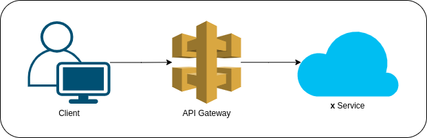

# What is Amazon API Gateway?

**Amazon API Gateway** is an AWS service for creating, publishing, maintaining, monitoring, and securing REST, HTTP, and WebSocket APIs at any scale. An application program interface (API) allows software programs to communicate, making them more functional.

An API gateway accepts and processes concurrent API calls, which happen when APIs submit requests to a server. It manages traffic, authorizes end users and monitors performance. Using Amazon API Gateway, a developer can connect with services such as:
* AWS Elastic Beanstalk
* Elastic Compute Cloud instances
* AWS Lambda event-driven code
* AWS Step Functions state machines

API Gateway acts as a "front door" for applications to access data, business logic, or functionality from your backend services, such as workloads running on Amazon Elastic Compute Cloud (Amazon EC2), code running on AWS Lambda, any web application, or real-time communication applications.

## What is an API?
An **application programming interface (API)** defines the rules that you must follow to communicate with other software systems. Developers expose or create APIs so that other applications can communicate with their applications programmatically. For example, the timesheet application exposes an API that asks for an employee's full name and a range of dates. When it receives this information, it internally processes the employee's timesheet and returns the number of hours worked in that date range.

You can think of a web API as a gateway between clients and resources on the web.

### Clients
**Clients** are users who want to access information from the web. The client can be a person or a software system that uses the API. For example, developers can write programs that access weather data from a weather system. Or you can access the same data from your browser when you visit the weather website directly.

### Resources
**Resources** are the information that different applications provide to their clients. Resources can be images, videos, text, numbers, or any type of data. The machine that gives the resource to the client is also called the *server*. Organizations use APIs to share resources and provide web services while maintaining security, control, and authentication. In addition, APIs help them to determine which clients get access to specific internal resources.

## Use Cases of API Gateway

### REST APIs
**Representational State Transfer (REST)** is a software architecture that imposes conditions on how an API should work. REST was initially created as a guideline to manage communication on a complex network like the internet. You can use REST-based architecture to support high-performing and reliable communication at scale. You can easily implement and modify it, bringing visibility and cross-platform portability to any API system.

**RESTful API** is an interface that two computer systems use to exchange information securely over the internet. Most business applications have to communicate with other internal and third-party applications to perform various tasks.

An **API Gateway REST API** is made up of resources and methods. A ***resource*** is a logical entity that an app can access through a resource path. A ***method*** corresponds to a REST API request that is submitted by the user of your API and the response returned to the user. In API Gateway REST APIs, the frontend is encapsulated by *method requests* and *method responses*. The API interfaces with the backend by means of *integration requests* and *integration responses*.

To route the integration response to an appropriate method response (of a given HTTP status code) to the client, you can configure the integration response to map required response parameters from integration to method. You then translate the output data format of the backend to that of the frontend, if necessary.

### HTTP APIs
**HTTP APIs** enable you to create RESTful APIs with lower latency and lower cost than REST APIs. You can use HTTP APIs to send requests to AWS Lambda functions or to any publicly routable HTTP endpoint. HTTP APIs support OpenID Connect and OAuth 2.0 authorization. They come with built-in support for cross-origin resource sharing (CORS) and automatic deployments.

### WebSocket APIs
In a **WebSocket API**, the client and the server can both send messages to each other at any time. Backend servers can easily push data to connected users and devices, avoiding the need to implement complex polling mechanisms. This API creates two-way communication channels over a single *Transmission Control Protocol* connection. It facilitates client-server communication in real-time applications, such as online games, web chat and stock trading systems. Unlike traditional HTTP APIs that rely on the client to initiate communication, the WebSocket API enables the server to send messages to the client without the client requesting them.

## Reference
* [Amazon API Gateway](https://www.techtarget.com/searchaws/definition/Amazon-API-Gateway)
* [What Is A RESTful API?](https://aws.amazon.com/what-is/restful-api)
* [Serverless Amazon API Gateway](https://www.serverless.com/guides/amazon-api-gateway)
* [Amazon API Gateway Documentation](https://docs.aws.amazon.com/apigateway/?icmpid=docs_homepage_serverless)
* [Choosing between REST APIs and HTTP APIs](https://docs.aws.amazon.com/apigateway/latest/developerguide/http-api-vs-rest.html)
* [API Gateway REST vs. HTTP API: What Are The Differences?](https://www.tinystacks.com/blog-post/api-gateway-rest-vs-http-api-what-are-the-differences/)