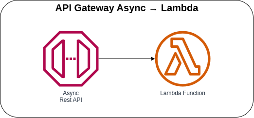

# API Gateway Async → Lambda



Invoking the Lambda function asynchronously with AWS API Gateway, you need to use an **Integration Type** of ***Lambda Integration***, make sure that the **Use Lambda Proxy Integration** option is not checked by setting the Lambda Integration **`proxy`** as ***false*** via CDK, and add a header mapping in the **Integration Request** (`X-Amz-Invocation-Type: 'Event'`).

### AWS CDK API / Developer Reference
* [AWS Lambda](https://docs.aws.amazon.com/cdk/api/v2/docs/aws-cdk-lib.aws_lambda-readme.html)
* [Amazon API Gateway](https://docs.aws.amazon.com/cdk/api/v2/docs/aws-cdk-lib.aws_apigateway-readme.html)

### AWS Documentation Developer Guide
* [Set up asynchronous invocation of the backend Lambda function](https://docs.aws.amazon.com/apigateway/latest/developerguide/set-up-lambda-integration-async.html)
* [Amazon API Gateway API request and response data mapping reference](https://docs.aws.amazon.com/apigateway/latest/developerguide/request-response-data-mappings.html)

### Useful commands
The `cdk.json` file tells the CDK Toolkit how to execute your app.

* `npm install`     install projects dependencies
* `npm run build`   compile typescript to js
* `npm run watch`   watch for changes and compile
* `npm run test`    perform the jest unit tests
* `cdk deploy`      deploy this stack to your default AWS account/region
* `cdk diff`        compare deployed stack with current state
* `cdk synth`       emits the synthesized CloudFormation template
* `cdk bootstrap`   deployment of AWS CloudFormation template to a specific AWS environment (account and region)
* `cdk destroy`     destroy this stack from your default AWS account/region

## Deploy

### Using `make` command
1. Install all the dependencies, bootstrap your project, and synthesized CloudFormation template.
  ```bash
  # Without passing "profile" parameter
  dev@dev:~:aws-cdk-samples/api-gateway/api-gateway-async-lambda$ make init

  # With "profile" parameter
  dev@dev:~:aws-cdk-samples/api-gateway/api-gateway-async-lambda$ make init profile=[profile_name]
  ```

2. Deploy the project.

  ```bash
  # Without passing "profile" parameter
  dev@dev:~:aws-cdk-samples/api-gateway/api-gateway-async-lambda$ make deploy

  # With "profile" parameter
  dev@dev:~:aws-cdk-samples/api-gateway/api-gateway-async-lambda$ make deploy profile=[profile_name]
  ```