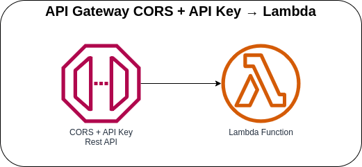

# API Gateway CORS + API Key → Lambda



Invoking the Lambda function with AWS API Gateway having CORS configured and an API key. If the API key value is not configured via CDK, it will automatically generate an API key for you.

API Request must include the following header:
* `X-Api-Key`

API Response must include the following response headers:
* `Access-Control-Allow-Origin`
* `Access-Control-Allow-Methods`

You can test the following by using the provided HTML file that is in the [web/static](web/static/index.html) directory. After deploying the stack, remember to update the API key and URL on the said HTML file.

## API Specification
### Coffee
When the API received an incoming request, it will validate if the required fields are present and will return an HTTP Status OK with the required response header.

**Method:** POST

**Endpoint:** `https://{api-id}.execute.api.{region}.amazonaws.com/prod/`

**Request Body:**
```json
{
  "name": "Galão",
  "description": "Originating in Portugal, this hot coffee drink is closely related to the latte and cappuccino.",
  "ingredients": ["Espresso", "Foamed milk"]
}
```

### AWS CDK API / Developer Reference
* [AWS Lambda](https://docs.aws.amazon.com/cdk/api/v2/docs/aws-cdk-lib.aws_lambda-readme.html)
* [Amazon API Gateway](https://docs.aws.amazon.com/cdk/api/v2/docs/aws-cdk-lib.aws_apigateway-readme.html)

### AWS Documentation Developer Guide
* [Cors](https://docs.aws.amazon.com/lambda/latest/dg/API_Cors.html)
* [Testing CORS](https://docs.aws.amazon.com/apigateway/latest/developerguide/apigateway-test-cors.html)
* [Configuring CORS for an HTTP API](https://docs.amazonaws.cn/en_us/apigateway/latest/developerguide/http-api-cors.html)
* [Enabling CORS for a REST API resource](https://docs.aws.amazon.com/apigateway/latest/developerguide/how-to-cors.html)
* [Enable CORS on a resource using the API Gateway console](https://docs.aws.amazon.com/apigateway/latest/developerguide/how-to-cors-console.html)

### Useful commands
The `cdk.json` file tells the CDK Toolkit how to execute your app.

* `npm install`     install projects dependencies
* `npm run build`   compile typescript to js
* `npm run watch`   watch for changes and compile
* `npm run test`    perform the jest unit tests
* `cdk deploy`      deploy this stack to your default AWS account/region
* `cdk diff`        compare deployed stack with current state
* `cdk synth`       emits the synthesized CloudFormation template
* `cdk bootstrap`   deployment of AWS CloudFormation template to a specific AWS environment (account and region)
* `cdk destroy`     destroy this stack from your default AWS account/region

## Deploy

### Using `make` command
1. Install all the dependencies, bootstrap your project, and synthesized CloudFormation template.
  ```bash
  # Without passing "profile" parameter
  dev@dev:~:aws-cdk-samples/api-gateway/api-gateway-cors-lambda$ make init

  # With "profile" parameter
  dev@dev:~:aws-cdk-samples/api-gateway/api-gateway-cors-lambda$ make init profile=[profile_name]
  ```

2. Deploy the project.

  ```bash
  # Without passing "profile" parameter
  dev@dev:~:aws-cdk-samples/api-gateway/api-gateway-cors-lambda$ make deploy

  # With "profile" parameter
  dev@dev:~:aws-cdk-samples/api-gateway/api-gateway-cors-lambda$ make deploy profile=[profile_name]
  ```