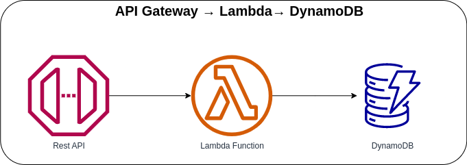

# API Gateway → Lambda → DynamoDB



Invoking the Lambda Function with AWS API Gateway and saving the processed request into the DynamoDB table.

## API Specification
### Coffee
When the API received an incoming request, it will validate if the required fields are present, create the key, and then insert the request data into DynamoDB Table.

**Method**: POST

**Endpoint**: https://{api-id}.execute.api.{region}.amazonaws.com/prod/

**Request Body**:
```json
{
  "name": "Galão",
  "description": "Originating in Portugal, this hot coffee drink is closely related to the latte and cappuccino.",
  "ingredients": ["Espresso", "Foamed milk"]
}
```

### AWS CDK API / Developer Reference
* [AWS Lambda](https://docs.aws.amazon.com/cdk/api/v2/docs/aws-cdk-lib.aws_lambda-readme.html)
* [AWS DynamoDB](https://docs.aws.amazon.com/cdk/api/v2/docs/aws-cdk-lib.aws_dynamodb-readme.html)
* [Amazon API Gateway](https://docs.aws.amazon.com/cdk/api/v2/docs/aws-cdk-lib.aws_apigateway-readme.html)

### AWS SDK v2 API / Developer Reference
* [DynamoDB Service Documentation](https://pkg.go.dev/github.com/aws/aws-sdk-go-v2/service/dynamodb)
* [Getting Started with the AWS SDK for Go V2](https://aws.github.io/aws-sdk-go-v2/docs/getting-started/)

### AWS Documentation Developer Guide
* [Core components of Amazon DynamoDB](https://docs.aws.amazon.com/amazondynamodb/latest/developerguide/HowItWorks.CoreComponents.html)
* [Tutorial: Using Lambda with API Gateway](https://docs.aws.amazon.com/lambda/latest/dg/services-apigateway-tutorial.html)
* [Using Sort Keys to Organize Data in Amazon DynamoDB](https://aws.amazon.com/blogs/database/using-sort-keys-to-organize-data-in-amazon-dynamodb/)
* [Tutorial: Build a CRUD API with Lambda and DynamoDB](https://docs.aws.amazon.com/apigateway/latest/developerguide/http-api-dynamo-db.html)
* [Best practices for designing and using partition keys effectively](https://docs.aws.amazon.com/amazondynamodb/latest/developerguide/bp-partition-key-design.html)

### Useful commands
The `cdk.json` file tells the CDK Toolkit how to execute your app.

* `npm install`     install projects dependencies
* `npm run build`   compile typescript to js
* `npm run watch`   watch for changes and compile
* `npm run test`    perform the jest unit tests
* `cdk deploy`      deploy this stack to your default AWS account/region
* `cdk diff`        compare deployed stack with current state
* `cdk synth`       emits the synthesized CloudFormation template
* `cdk bootstrap`   deployment of AWS CloudFormation template to a specific AWS environment (account and region)
* `cdk destroy`     destroy this stack from your default AWS account/region

## Deploy

### Using `make` command
1. Install all the dependencies, bootstrap your project, and synthesized CloudFormation template.
  ```bash
  # Without passing "profile" parameter
  dev@dev:~:aws-cdk-samples/api-gateway/api-gateway-async-lambda$ make init

  # With "profile" parameter
  dev@dev:~:aws-cdk-samples/api-gateway/api-gateway-async-lambda$ make init profile=[profile_name]
  ```

2. Deploy the project.

  ```bash
  # Without passing "profile" parameter
  dev@dev:~:aws-cdk-samples/api-gateway/api-gateway-async-lambda$ make deploy

  # With "profile" parameter
  dev@dev:~:aws-cdk-samples/api-gateway/api-gateway-async-lambda$ make deploy profile=[profile_name]
  ```