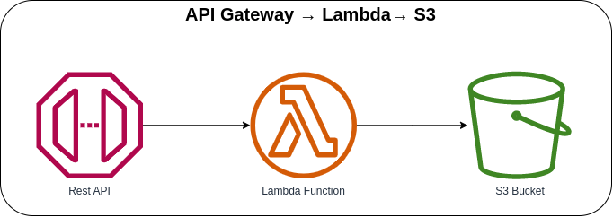

# API Gateway → Lambda → S3 Bucket



Invoking the Lambda Function with AWS API Gateway and saving the processed request to an S3 Bucket. When naming the *bucket*, it must be unique globally. If you get the *`"Bucket name already exists"`* error, you must use a different bucket name to create the bucket.

## API Specification

### Coffee
When the API received an incoming request, it will validate if the required fields are present and then upload the processed request to an S3 Bucket.

**Method**: POST

**Endpoint**: `https://{api-id}.execute.api.{region}.amazonaws.com/prod/`

**Request Body**:
```json
{
  "name": "Galão",
  "description": "Originating in Portugal, this hot coffee drink is closely related to the latte and cappuccino.",
  "ingredients": ["Espresso", "Foamed milk"]
}
```

### AWS CDK API / Developer Reference
* [Amazon S3](https://docs.aws.amazon.com/cdk/api/v2/docs/aws-cdk-lib.aws_s3-readme.html)
* [AWS Lambda](https://docs.aws.amazon.com/cdk/api/v2/docs/aws-cdk-lib.aws_lambda-readme.html)
* [Amazon API Gateway](https://docs.aws.amazon.com/cdk/api/v2/docs/aws-cdk-lib.aws_apigateway-readme.html)

### AWS SDK v2 API / Developer Reference
* [S3 Service Documentation](https://pkg.go.dev/github.com/aws/aws-sdk-go-v2/service/s3)
* [Getting Started with the AWS SDK for Go V2](https://aws.github.io/aws-sdk-go-v2/docs/getting-started/)

### AWS Documentation Developer Guide
* [Bucket restrictions and limitations](https://docs.aws.amazon.com/AmazonS3/latest/userguide/BucketRestrictions.html)
* [Using AWS Lambda with Amazon API Gateway](https://docs.aws.amazon.com/lambda/latest/dg/services-apigateway.html)
* [How can I resolve the "Bucket name already exists" or "BucketAlreadyExists" error from Amazon S3?](https://repost.aws/knowledge-center/s3-error-bucket-already-exists)

### Useful commands
The `cdk.json` file tells the CDK Toolkit how to execute your app.

* `npm install`     install projects dependencies
* `npm run build`   compile typescript to js
* `npm run watch`   watch for changes and compile
* `npm run test`    perform the jest unit tests
* `cdk deploy`      deploy this stack to your default AWS account/region
* `cdk diff`        compare deployed stack with current state
* `cdk synth`       emits the synthesized CloudFormation template
* `cdk bootstrap`   deployment of AWS CloudFormation template to a specific AWS environment (account and region)
* `cdk destroy`     destroy this stack from your default AWS account/region

## Deploy

### Using `make` command
1. Install all the dependencies, bootstrap your project, and synthesized CloudFormation template.
    ```bash
    # Without passing "profile" parameter
    dev@dev:~:aws-cdk-samples/api-gateway/api-gateway-lambda-s3$ make init

    # With "profile" parameter
    dev@dev:~:aws-cdk-samples/api-gateway/api-gateway-lambda-s3$ make init profile=[profile_name]
    ```

2. Deploy the project.
    ```bash
    # Without passing "profile" parameter
    dev@dev:~:aws-cdk-samples/api-gateway/api-gateway-lambda-s3$ make deploy

    # With "profile" parameter
    dev@dev:~:aws-cdk-samples/api-gateway/api-gateway-lambda-s3$ make deploy profile=[profile_name]
    ```