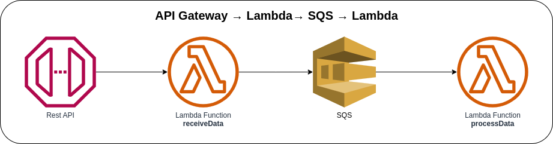

# API Gateway → Lambda → SQS → Lambda



Invoking the Lambda Function with AWS API Gateway and sending the received request to an SQS Queue. The second Lambda Function will be triggered once it receives the event message from the SQS Queue. The SQS Queue is configured as ".fifo" (First-In-First-Out), which means the messages are ordered based on message group ID and where duplicates can't be tolerated.

## API Specification

### Product
When the API received an incoming request, it will validate if the required fields are present and then send the message to the specified queue. The second Lambda Function will process the event message once the queue receives the message.

**Method**: POST

**Endpoint**: `https://{api-id}.execute.api.{region}.amazonaws.com/prod/`

**Request Body**:
```json
{
  "name": "Garmin Venu 2 Plus",
  "description": "All-round watch for both exercise and health",
  "price": 307.40,
  "category": {
    "id": "1",
    "name": "Jewelry & watches"
  }
}
```

### AWS CDK API / Developer Reference
* [Amazon SQS](https://docs.aws.amazon.com/cdk/api/v2/docs/aws-cdk-lib.aws_sqs-readme.html)
* [AWS Lambda](https://docs.aws.amazon.com/cdk/api/v2/docs/aws-cdk-lib.aws_lambda-readme.html)
* [Amazon API Gateway](https://docs.aws.amazon.com/cdk/api/v2/docs/aws-cdk-lib.aws_apigateway-readme.html)
* [AWS Lambda Event Sources](https://docs.aws.amazon.com/cdk/api/v2/docs/aws-cdk-lib.aws_lambda_event_sources-readme.html)

### AWS SDK v2 API / Developer Reference
* [SQS Service Documentation](https://pkg.go.dev/github.com/aws/aws-sdk-go-v2/service/sqs)
* [Getting Started with the AWS SDK for Go V2](https://aws.github.io/aws-sdk-go-v2/docs/getting-started/)

### AWS Documentation Developer Guide
* [Using Lambda with Amazon SQS](https://docs.aws.amazon.com/lambda/latest/dg/with-sqs.html)
* [Amazon SQS dead-letter queues](https://docs.aws.amazon.com/AWSSimpleQueueService/latest/SQSDeveloperGuide/sqs-dead-letter-queues.html)
* [Amazon SQS visibility timeout](https://docs.aws.amazon.com/AWSSimpleQueueService/latest/SQSDeveloperGuide/sqs-visibility-timeout.html)
* [Tutorial: Using Lambda with Amazon SQS](https://docs.aws.amazon.com/lambda/latest/dg/with-sqs-example.html)
* [Amazon SQS FIFO (First-In-First-Out) queues](https://docs.aws.amazon.com/AWSSimpleQueueService/latest/SQSDeveloperGuide/FIFO-queues.html)

### Useful commands
The `cdk.json` file tells the CDK Toolkit how to execute your app.

* `npm install`     install projects dependencies
* `npm run build`   compile typescript to js
* `npm run watch`   watch for changes and compile
* `npm run test`    perform the jest unit tests
* `cdk deploy`      deploy this stack to your default AWS account/region
* `cdk diff`        compare deployed stack with current state
* `cdk synth`       emits the synthesized CloudFormation template
* `cdk bootstrap`   deployment of AWS CloudFormation template to a specific AWS environment (account and region)
* `cdk destroy`     destroy this stack from your default AWS account/region

## Deploy

### Using `make` command
1. Install all the dependencies, bootstrap your project, and synthesized CloudFormation template.
    ```bash
    # Without passing "profile" parameter
    dev@dev:~:aws-cdk-samples/api-gateway/api-gateway-lambda-sqs$ make init

    # With "profile" parameter
    dev@dev:~:aws-cdk-samples/api-gateway/api-gateway-lambda-sqs$ make init profile=[profile_name]
    ```

2. Deploy the project.
    ```bash
    # Without passing "profile" parameter
    dev@dev:~:aws-cdk-samples/api-gateway/api-gateway-lambda-sqs$ make deploy

    # With "profile" parameter
    dev@dev:~:aws-cdk-samples/api-gateway/api-gateway-lambda-sqs$ make deploy profile=[profile_name]
    ```