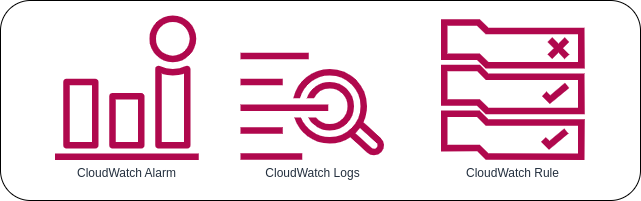

# What is Amazon CloudWatch?

**Amazon CloudWatch** monitors your Amazon Web Services (AWS) resources and the applications you run on AWS in real time. You can use CloudWatch to collect and track metrics, which are variables you can measure for your resources and applications. It is designed for AWS users, including DevOps engineers, IT managers, cloud developers and site reliability engineers.

The CloudWatch home page automatically displays metrics about every AWS service you use. You can additionally create custom dashboards to display metrics about your custom applications, and display custom collections of metrics that you choose. Users can also stipulate additional metrics to be monitored, such as memory usage, transaction volumes or error rates.

The primary function of CloudWatch is to track resource and application performance based on metrics you define. Setting an alarm for resources that exceed a specific metric, you can tell CloudWatch to perform a specific task when an alarm is triggered. The task could be to send a notification, or invoke a lambda function to perform a task in response to the alarm.

### Metrics
**Metrics** are data about the performance of your systems. By default, many services provide free metrics for resources (such as Amazon EC2 instances, Amazon EBS volumes, and Amazon RDS DB instances). You can also enable detailed monitoring for some resources, such as your Amazon EC2 instances, or publish your own application metrics. Amazon CloudWatch can load all the metrics in your account (both AWS resource metrics and application metrics that you provide) for search, graphing, and alarms.

There are a number of metrics that are automatically built in to AWS service like EC2 and are sent to CloudWatch by default every 5 minutes. You can set up detailed monitoring to increase the frequency of communication between an AWS service and CloudWatch and you are also able to create your own metrics to pass to CloudWatch in addition to the metrics already built in.

### Alarm
An **alarm** tracks the data points you define and will trigger when the value of the tracked metric exceeds the defined value for a nominated period of time. Say for instance if an EC2 instance CPU usage exceeds 80% for more than 5 minutes, the alarm will send out a notification message to the nominated destination.

The destination for the notification could be a SNS topic that could then send an email alert or SMS notification, or the notification could be sent to an autoscaling policy to trigger scaling out an auto scaling group in response to heavy load on an instance CPU.

You can create *metric* and *composite alarms* in Amazon CloudWatch.

#### Metric alarm
A **metric alarm** watches a single CloudWatch metric or the result of a math expression based on CloudWatch metrics. The alarm performs one or more actions based on the value of the metric or expression relative to a threshold over a number of time periods. The action can be sending a notification to an Amazon SNS topic, performing an Amazon EC2 action or an Amazon EC2 Auto Scaling action, or creating an OpsItem or incident in Systems Manager.

#### Composite alarm
A **composite alarm** includes a rule expression that takes into account the alarm states of other alarms that you have created. The composite alarm goes into ALARM state only if all conditions of the rule are met. The alarms specified in a composite alarm's rule expression can include metric alarms and other composite alarms.

### Events
**Amazon CloudWatch Events** delivers a near real-time stream of system events that describe changes in Amazon Web Services (AWS) resources. Using simple rules that you can quickly set up, you can match events and route them to one or more target functions or streams. CloudWatch Events becomes aware of operational changes as they occur. CloudWatch Events responds to these operational changes and takes corrective action as necessary, by sending messages to respond to the environment, activating functions, making changes, and capturing state information.

#### Events
An **event** indicates a change in your AWS environment. AWS resources can generate events when their state changes. For example, Amazon EC2 generates an event when the state of an EC2 instance changes from pending to running, and Amazon EC2 Auto Scaling generates events when it launches or terminates instances. AWS CloudTrail publishes events when you make API calls. You can generate custom application-level events and publish them to CloudWatch Events. You can also set up scheduled events that are generated on a periodic basis.

Events which are represented as small JSON blobs and can be generated in four different ways:
* When a service changes state, such as a service moving from a pending to running state.
* Through API calls or console sign-ins that reach CloudWatch Events from CloudTrail.
* Custom code can publish application specific events to CloudWatch Events.
* Through a scheduled Cron-like job.

#### Rules
A **rule** matches incoming events and routes them to targets for processing. A single rule can route to multiple targets, all of which are processed in parallel. Rules are not processed in a particular order. This enables different parts of an organization to look for and process the events that are of interest to them. A rule can customize the JSON sent to the target, by passing only certain parts or by overwriting it with a constant.

#### Targets
A target processes events. Targets can include Amazon EC2 instances, AWS Lambda functions, Kinesis streams, Amazon ECS tasks, Step Functions state machines, Amazon SNS topics, Amazon SQS queues, and built-in targets. A target receives events in JSON format.

**NOTE**: A rule's targets must be in the same Region as the rule.

## Use Cases of Amazon CloudWatch
CloudWatch collects data for operational and monitoring purposes with a unified view and can deploy automated responses to monitored metrics reaching a specified threshold.

* To help fix operational issues and optimize performance using log analytics
* Monitor AWS applications in the cloud or on premises
* Monitor and troubleshoot the AWS infrastructure
* Optimize system resources

## Reference
* [TechTarget AWS CloudWatch](https://www.techtarget.com/searchaws/definition/CloudWatch)
* [Using Amazon CloudWatch alarms](https://docs.aws.amazon.com/AmazonCloudWatch/latest/monitoring/AlarmThatSendsEmail.html)
* [Using Amazon CloudWatch metrics](https://docs.aws.amazon.com/AmazonCloudWatch/latest/monitoring/working_with_metrics.html)
* [Amazon CloudWatch Documentation](https://docs.aws.amazon.com/cloudwatch/?icmpid=docs_homepage_mgmtgov)
* [What Is Amazon CloudWatch Events?](https://docs.aws.amazon.com/AmazonCloudWatch/latest/events/WhatIsCloudWatchEvents.html)
* [Introducing AWS CloudWatch Events](https://www.infoq.com/news/2016/02/AWS-CloudWatch-Events/)