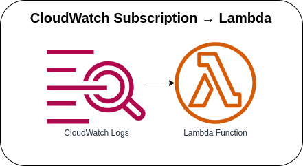
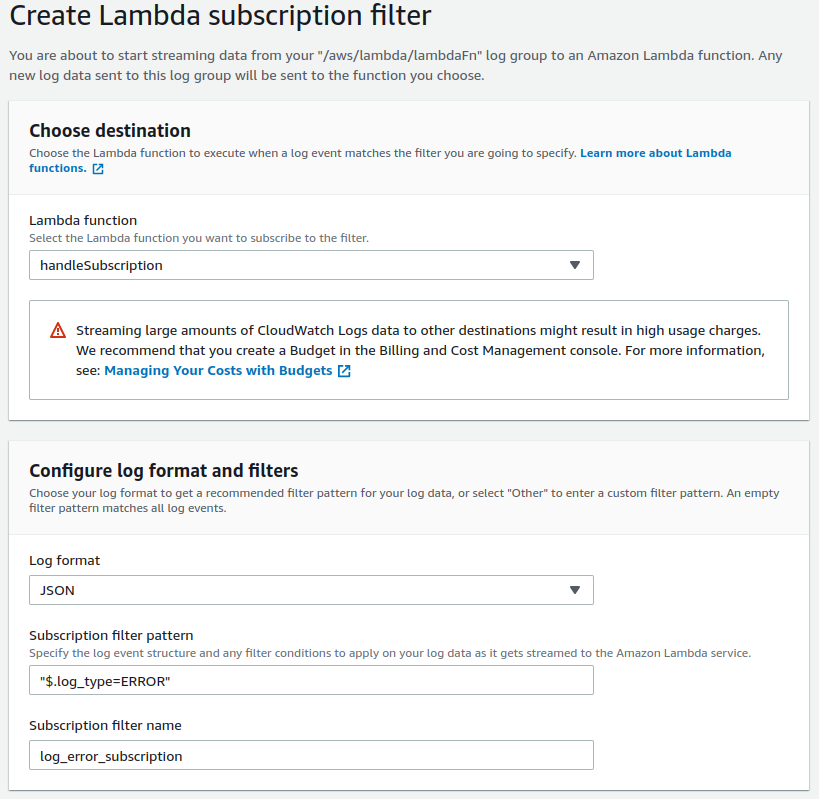

# CloudWatch Subscription → Lambda



Invoking the Lambda Function with a CloudWatch Logs event. Every log that is created or matches the filter pattern will automatically invoke the Lambda Function and log the received event. If you want multiple log groups for a single subscription, you can create multiple `SubscriptionFilter` instances with different log groups but the same Lambda function as the destination. If you want to create a Lambda Subscription Filter via Console or AWS CLI, you can comment out the CloudWatch-related CDK code in the stack file and follow the steps below.

## CloudWatch Logs Permission
Grant CloudWatch Logs permission to execute the Lambda Function. Use the following command and replace the placeholder `account_id` with your account, and the placeholder `region` with your desired region.

```bash
aws lambda add-permission \
--function-name "handleSubscription" \
--statement-id "handleSubscription" \
--principal "logs.amazonaws.com" \
--action "lambda:InvokeFunction" \
--source-arn "arn:aws:logs:region:account_id:log-group:*:*" \
--source-account "account_id"
```

### Create Lambda Subscription Filter via Console
1. Go to CloudWatch → Logs → Log groups → Log Group Name
2. Go to Subscription filters → Create → Create Lambda subscription filter
3. Choose the Lambda function for the destination that you want to subscribe to the filter
4. Configure log format and filters

Here's a sample lambda subscription filter:



### Create Lambda Subscription Filter via AWS CLI
1. Create a subscription filter using the following command and replace the placeholder `account_id` with your account, the placeholder `region` with your desired region, the placeholder `log_group_name` with the log group to process, and the placeholder `filter_pattern` with your desired pattern.

    ```bash
    aws logs put-subscription-filter \
    --log-group-name "log_group_name" \
    --filter-name "log_error_subscription" \
    --filter-pattern "filter_pattern" \
    --destination-arn "arn:aws:lambda:region:account_id:function:handleSubscription"
    ```

### AWS CDK API / Developer Reference
* [AWS Lambda](https://docs.aws.amazon.com/cdk/api/v2/docs/aws-cdk-lib.aws_lambda-readme.html)
* [Amazon CloudWatch Logs](https://docs.aws.amazon.com/cdk/api/v2/docs/aws-cdk-lib.aws_logs-readme.html)
* [AWS CloudWatch Logs Subscription Destination](https://docs.aws.amazon.com/cdk/api/v2/docs/aws-cdk-lib.aws_logs_destinations-readme.html)

### AWS SDK v2 API / Developer Reference
* [Getting Started with the AWS SDK for Go V2](https://aws.github.io/aws-sdk-go-v2/docs/getting-started/)

### AWS Documentation Developer Guide
* [What is Amazon CloudWatch?](https://docs.aws.amazon.com/AmazonCloudWatch/latest/monitoring/WhatIsCloudWatch.html)
* [What Is Amazon CloudWatch Events?](https://docs.aws.amazon.com/AmazonCloudWatch/latest/events/WhatIsCloudWatchEvents.html)
* [Using Lambda with CloudWatch Logs](https://docs.aws.amazon.com/lambda/latest/dg/services-cloudwatchlogs.html)
* [Using CloudWatch Logs subscription filters](https://docs.aws.amazon.com/AmazonCloudWatch/latest/logs/SubscriptionFilters.html)
* [Using Subscription Filters in Amazon CloudWatch Logs](https://docs.aws.amazon.com/sdk-for-javascript/v2/developer-guide/cloudwatch-examples-subscriptions.html)
* [Creating a role to delegate permissions to an AWS service](https://docs.aws.amazon.com/IAM/latest/UserGuide/id_roles_create_for-service.html)

### Useful commands

* `npm run build`   compile typescript to js
* `npm run watch`   watch for changes and compile
* `npm run test`    perform the jest unit tests
* `cdk deploy`      deploy this stack to your default AWS account/region
* `cdk diff`        compare deployed stack with current state
* `cdk synth`       emits the synthesized CloudFormation template

## Deploy

### Using make command
1. Install all the dependencies, bootstrap your project, and synthesized CloudFormation template.
    ```bash
    # Without passing "profile" parameter
    dev@dev:~:aws-cdk-samples/cloudwatch/cloudwatch-subscription-lambda$ make init

    # With "profile" parameter
    dev@dev:~:aws-cdk-samples/cloudwatch/cloudwatch-subscription-lambda$ make init profile=[profile_name]
    ```

2. Deploy the project.
    ```bash
    # Without passing "profile" parameter
    dev@dev:~:aws-cdk-samples/cloudwatch/cloudwatch-subscription-lambda$ make deploy

    # With "profile" parameter
    dev@dev:~:aws-cdk-samples/cloudwatch/cloudwatch-subscription-lambda$ make deploy profile=[profile_name]
    ```