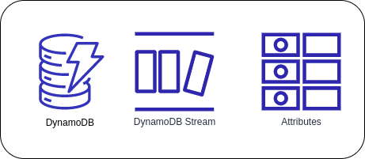

# What is Amazon DynamoDB?

**Amazon DynamoDB** is a fully managed NoSQL database service that provides fast and predictable performance with seamless scalability. DynamoDB lets you offload the administrative burdens of operating and scaling a distributed database so that you don't have to worry about hardware provisioning, setup and configuration, replication, software patching, or cluster scaling. With DynamoDB, you can create database tables that can store and retrieve any amount of data and serve any level of request traffic. You can scale up or down your tables' throughput capacity without downtime or performance degradation.

Amazon DynamoDB offers:
* Reliable performance even as it scales
* A managed experience, so you won't be SSH-ing into servers to upgrade the crypto libraries
* A small, simple API allowing for simple key-value access as well as more advanced query patterns.

## Amazon DynamoDB Throughput Capacity
### Provisioned Mode
In a **provisioned mode**, you need to specify the number of reads and writes per second required by the application. It defines the maximum amount of capacity that an application can use from a specified table. If the limit of provisioned mode throughput capacity is exceeded, then this leads to request throttling. A provisioned mode is good for applications that have predictable and consistent traffic.

With provisioned capacity, you pay for the provision of read and write capacity units for your DynamoDB tables and you can also use auto-scaling to automatically adjust your table's capacity based on the specified utilization rate to ensure application performance, and also to potentially reduce costs. Provisioned mode is a good option if any of the following are true:
* You have predictable application traffic
* You run applications whose traffic is consistent or ramps gradually
* You can forecast capacity requirements to control costs

#### Read Capacity Unit
It is the total number of read capacity units depending on the item size and read consistency model. Read capacity unit represents two types of consistency models:

* **Strongly consistent model**
  - Read Capacity Unit represents one strong consistent read per second for an item up to 4KB in size.

* **Eventually consistent model**
  - Read Capacity Unit represents two eventually consistent reads per second for an item up to 4KB in size.

#### Write Capacity Unit
The total number of write capacity units depends on the item size. One write capacity unit represents one write per second for an item up to 1KB in size. If you need to write an item that is larger than 1 KB, DynamoDB must consume additional write capacity units.

### On-demand Mode
DynamoDB **on-demand mode** has a flexible new billing option that is capable of serving thousands of requests per second without any scaling planning. On-demand mode offers pay-per-request pricing for read and writes requests so that you need to pay only for what you use, thus, making it easy to balance costs and performance.

When you choose an on-demand mode, DynamoDB instantly accommodates your workloads as they ramp up or down to any previously reached traffic level. If a workload's traffic level hits a new peak, DynamoDB adapts rapidly to accommodate the workload. An on-demand mode is a good option if any of the following are true:
* You create new tables with unknown workloads
* You have unpredictable application traffic
* You prefer the ease of paying for only what you use

#### Read Request Units and Write Request Units
DynamoDB read requests can be either strongly consistent, eventually consistent, or transactional.
* A *strongly consistent*  read request of an item up to 4KB requires one read request unit.
* An *eventually consistent* read request of an item up to 4KB requires one-half read request unit.
* A *transactional* read request of an item up to 4KB requires two read request units.

One *write request unit* represents one write for an item up to 1KB in size. If you need to write an item that is larger than 1KB, DynamoDB needs to consume additional write request units. Transactional write requires 2 write request units to perform one write for items up to 1KB. The total number of write request units required depends on the item size.

## Core components of Amazon DynamoDB
### Tables, items, and attributes

#### Tables
Similar to other database systems, DynamoDB stores data in tables. A **table** is a collection of data. For example, you might have a `Users` table to store data about your users, and an `Orders` table to store data about your users' orders.

#### Items
Each table contains zero or more items. An **item** is a group of attributes that is uniquely identifiable among all of the other items. In your `Users` table, an item would be a particular User. An item is similar to a row in a relational database. In DynamoDB, there is no limit to the number of items you can store in a table.

#### Attributes
Each item is composed of one or more attributes. An **attribute** is a fundamental data element, something that does not need to be broken down any further. Attributes in DynamoDB are similar in many ways to fields or columns in other database systems. This could be a simple `Age` attribute that stores the age of a user.

### Primary Key
The **primary key** uniquely identifies each item in the table, so that no two items can have the same key. DynamoDB uses the partition key's value as input to an internal hash function.

#### Simple Primary Key (Partition Key)
A **simple primary key** is composed of one attribute known as the *partition key*. In a table that has only a partition key, no two items can have the same partition key value.

#### Composite Primary Key (Partition Key and Sort Key)
Referred to as a **composite primary key**, this type of key is composed of two attributes. The first attribute is the partition key, and the second attribute is the sort key. DynamoDB uses the partition key value as input to an internal hash function. All items with the same partition key value are stored together, in sorted order by sort key value.

### Secondary Indexes
A **secondary index** lets you query the data in the table using an alternate key, in addition to queries against the primary key. DynamoDB doesn't require that you use indexes, but they give your applications more flexibility when querying your data. After you create a secondary index on a table, you can read data from the index in much the same way as you do from the table.

DynamoDB supports two kinds of indexes:
* **Global secondary index** – An index with a partition key and sort key that can be different from those on the table.
* **Local secondary index** – An index that has the same partition key as the table, but a different sort key.

### DynamoDB Streams
**DynamoDB Streams** is an optional feature that captures data modification events in DynamoDB tables. The data about these events appear in the stream in near-real time, and in the order that the events occurred. Each event is represented by a *stream record*. If you enable a stream on a table, DynamoDB Streams writes a stream record whenever one of the following events occurs:
* *A new item is added to the table*: The stream captures an image of the entire item, including all of its attributes.
* *An item is updated*: The stream captures the "before" and "after" image of any attributes that were modified in the item.
* *An item is deleted from the table*: The stream captures an image of the entire item before it was deleted.

## Reference
* [What is DynamoDB?](https://www.javatpoint.com/aws-dynamodb)
* [What is Amazon DynamoDB?](https://docs.aws.amazon.com/amazondynamodb/latest/developerguide/Introduction.html)
* [Read/write capacity mode](https://docs.aws.amazon.com/amazondynamodb/latest/developerguide/HowItWorks.ReadWriteCapacityMode.html)
* [AWS DynamoDB Key Concepts](https://www.dynamodbguide.com/key-concepts)
* [Core components of Amazon DynamoDB](https://docs.aws.amazon.com/amazondynamodb/latest/developerguide/HowItWorks.CoreComponents.html)
* [DynamoDB on-demand and provisioned capacity](https://docs.aws.amazon.com/wellarchitected/latest/serverless-applications-lens/capacity.html)