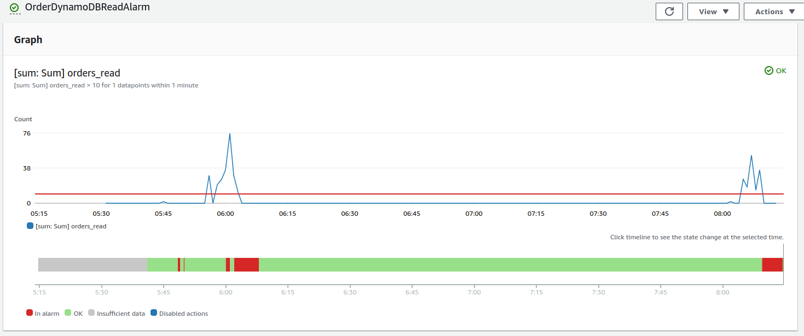

# DynamoDB Stream → Lambda


Monitoring the Amazon DynamoDB by creating a CloudWatch Alarm that sends an Amazon SNS message when the alarm changes state.

### Sample DynamoDB CloudWatch Alarms


### Sample DynamoDB CloudWatch Alarm Graph


### Sample CloudWatch Alarm SNS Action Email


### Test the Alarm
```bash
aws cloudwatch set-alarm-state --alarm-name YOUR_ALARM_NAME --state-reason "initializing" --state-value ALARM
```

### AWS CDK API / Developer Reference
* [AWS DynamoDB](https://docs.aws.amazon.com/cdk/api/v2/docs/aws-cdk-lib.aws_dynamodb-readme.html)
* [Amazon CloudWatch](https://docs.aws.amazon.com/cdk/api/v2/docs/aws-cdk-lib.aws_cloudwatch-readme.html)
* [CloudWatch Alarm Actions](https://docs.aws.amazon.com/cdk/api/v2/docs/aws-cdk-lib.aws_cloudwatch_actions-readme.html)
* [Amazon Simple Notification](https://docs.aws.amazon.com/cdk/api/v2/docs/aws-cdk-lib.aws_sns-readme.html)
* [Amazon Simple Notification Service Subscriptions](https://docs.aws.amazon.com/cdk/api/v2/docs/aws-cdk-lib.aws_sns_subscriptions-readme.html)

### AWS Documentation Developer Guide
* [Monitoring with Amazon CloudWatch](https://docs.aws.amazon.com/amazondynamodb/latest/developerguide/monitoring-cloudwatch.html)
* [Core components of Amazon DynamoDB](https://docs.aws.amazon.com/amazondynamodb/latest/developerguide/HowItWorks.CoreComponents.html)
* [Creating CloudWatch alarms to monitor DynamoDB](https://docs.aws.amazon.com/amazondynamodb/latest/developerguide/creating-alarms.html)
* [Best practices for designing and using partition keys effectively](https://docs.aws.amazon.com/amazondynamodb/latest/developerguide/bp-partition-key-design.html)

### Useful commands

* `npm run build`   compile typescript to js
* `npm run watch`   watch for changes and compile
* `npm run test`    perform the jest unit tests
* `cdk deploy`      deploy this stack to your default AWS account/region
* `cdk diff`        compare deployed stack with current state
* `cdk synth`       emits the synthesized CloudFormation template

## Deploy

### Using make command
1. Install all the dependencies, bootstrap your project, and synthesized CloudFormation template.
    ```bash
    # Without passing "profile" parameter
    dev@dev:~:aws-cdk-samples/dynamodb/dynamodb-alarm-metrics$ make init

    # With "profile" parameter
    dev@dev:~:aws-cdk-samples/dynamodb/dynamodb-alarm-metrics$ make init profile=[profile_name]
    ```

2. Deploy the project.
    ```bash
    # Without passing "profile" parameter
    dev@dev:~:aws-cdk-samples/dynamodb/dynamodb-alarm-metrics$ make deploy

    # With "profile" parameter
    dev@dev:~:aws-cdk-samples/dynamodb/dynamodb-alarm-metrics$ make deploy profile=[profile_name]
    ```