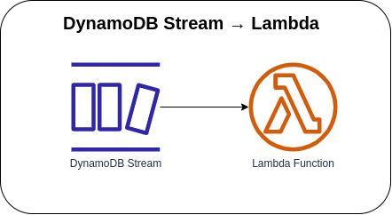

# DynamoDB Stream → Lambda



Capturing the write (Put, Delete, Update) operation of a DynamoDB stream that will be processed by a Lambda function. The Lambda Function reads the records from the stream and invokes the function synchronously with an event that contains stream records.

### Sample CloudWatch Logs
#### DynamoDB Insert
```json
{
    "log_code": "DynamoDBStreamRecord",
    "log_msg": "Events from the DynamoDB Table",
    "log_level": "INFO",
    "log_keys": {
        "record": {
            "awsRegion": "us-east-1",
            "dynamodb": {
                "ApproximateCreationDateTime": 1689103530,
                "Keys": {
                    "referenceId": {
                        "S": "sample-reference-id-12345"
                    }
                },
                "NewImage": {
                    "change": {
                        "N": "249.5"
                    },
                    "customer_id": {
                        "S": "customer-12345"
                    },
                    "quantity": {
                        "N": "25"
                    },
                    "referenceId": {
                        "S": "sample-reference-id-12345"
                    },
                    "total": {
                        "N": "1250.5"
                    }
                },
                "SequenceNumber": "100000000006899888825",
                "SizeBytes": 126,
                "StreamViewType": "NEW_IMAGE"
            },
            "eventID": "12ab34c567de89f10fedc11b1a07e92b",
            "eventName": "INSERT",
            "eventSource": "aws:dynamodb",
            "eventVersion": "1.1",
            "eventSourceARN": "arn:aws:dynamodb:us-east-1:123456789101:table/orders/stream/2023-05-19T02:24:40.803"
        }
    },
    "log_timestamp": "2023-05-19 02:30:49"
}
```

#### DynamoDB Modify
```json
{
    "log_code": "DynamoDBStreamRecord",
    "log_msg": "Events from the DynamoDB Table",
    "log_level": "INFO",
    "log_keys": {
        "record": {
            "awsRegion": "us-east-1",
            "dynamodb": {
                "ApproximateCreationDateTime": 1689103530,
                "Keys": {
                    "referenceId": {
                        "S": "sample-reference-id-12345"
                    }
                },
                "NewImage": {
                    "cash": {
                        "N": "1500"
                    },
                    "change": {
                        "N": "249.5"
                    },
                    "customer_id": {
                        "S": "customer-12345"
                    },
                    "quantity": {
                        "N": "25"
                    },
                    "referenceId": {
                        "S": "sample-reference-id-12345"
                    },
                    "total": {
                        "N": "1250.5"
                    }
                },
                "SequenceNumber": "200000000006399151338",
                "SizeBytes": 132,
                "StreamViewType": "NEW_IMAGE"
            },
            "eventID": "12ab34c567de89f10fedc11b1a07e92b",
            "eventName": "MODIFY",
            "eventSource": "aws:dynamodb",
            "eventVersion": "1.1",
            "eventSourceARN": "arn:aws:dynamodb:us-east-1:123456789101:table/orders/stream/2023-05-19T02:24:40.803"
        }
    },
    "log_timestamp": "2023-05-19 02:31:40"
}
```

#### DynamoDB Remove
```json
{
    "log_code": "DynamoDBStreamRecord",
    "log_msg": "Events from the DynamoDB Table",
    "log_level": "INFO",
    "log_keys": {
        "record": {
            "awsRegion": "us-east-1",
            "dynamodb": {
                "ApproximateCreationDateTime": 1689103530,
                "Keys": {
                    "referenceId": {
                        "S": "sample-reference-id-12345"
                    }
                },
                "SequenceNumber": "300000000006899888825",
                "SizeBytes": 36,
                "StreamViewType": "NEW_IMAGE"
            },
            "eventID": "12ab34c567de89f10fedc11b1a07e92b",
            "eventName": "REMOVE",
            "eventSource": "aws:dynamodb",
            "eventVersion": "1.1",
            "eventSourceARN": "arn:aws:dynamodb:us-east-1:123456789101:table/orders/stream/2023-05-19T02:24:40.803"
        }
    },
    "log_timestamp": "2023-05-19 02:32:10"
}
```

### AWS CDK API / Developer Reference
* [AWS Lambda](https://docs.aws.amazon.com/cdk/api/v2/docs/aws-cdk-lib.aws_lambda-readme.html)
* [AWS DynamoDB](https://docs.aws.amazon.com/cdk/api/v2/docs/aws-cdk-lib.aws_dynamodb-readme.html)
* [AWS Lambda Event Sources](https://docs.aws.amazon.com/cdk/api/v2/docs/aws-cdk-lib.aws_lambda_event_sources-readme.html)

### AWS SDK v2 API / Developer Reference
* [AWS Lambda Events](https://github.com/aws/aws-lambda-go/blob/main/events/README.md)
* [Getting Started with the AWS SDK for Go V2](https://aws.github.io/aws-sdk-go-v2/docs/getting-started/)

### AWS Documentation Developer Guide
* [Core components of Amazon DynamoDB](https://docs.aws.amazon.com/amazondynamodb/latest/developerguide/HowItWorks.CoreComponents.html)
* [Using AWS Lambda with Amazon DynamoDB](https://docs.aws.amazon.com/lambda/latest/dg/with-ddb.html)
* [Change data capture for DynamoDB Streams](https://docs.aws.amazon.com/amazondynamodb/latest/developerguide/Streams.html)
* [Best practices for designing and using partition keys effectively](https://docs.aws.amazon.com/amazondynamodb/latest/developerguide/bp-partition-key-design.html)

### Useful commands

* `npm run build`   compile typescript to js
* `npm run watch`   watch for changes and compile
* `npm run test`    perform the jest unit tests
* `cdk deploy`      deploy this stack to your default AWS account/region
* `cdk diff`        compare deployed stack with current state
* `cdk synth`       emits the synthesized CloudFormation template

## Deploy

### Using make command
1. Install all the dependencies, bootstrap your project, and synthesized CloudFormation template.
    ```bash
    # Without passing "profile" parameter
    dev@dev:~:aws-cdk-samples/dynamodb/dynamodb-stream-lambda$ make init

    # With "profile" parameter
    dev@dev:~:aws-cdk-samples/dynamodb/dynamodb-stream-lambda$ make init profile=[profile_name]
    ```

2. Deploy the project.
    ```bash
    # Without passing "profile" parameter
    dev@dev:~:aws-cdk-samples/dynamodb/dynamodb-stream-lambda$ make deploy

    # With "profile" parameter
    dev@dev:~:aws-cdk-samples/dynamodb/dynamodb-stream-lambda$ make deploy profile=[profile_name]
    ```