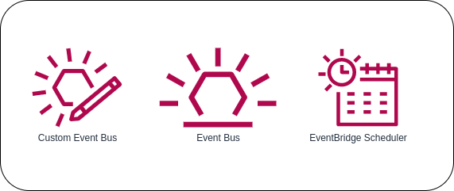

# What is Amazon EventBridge?

**EventBridge** is a serverless service that uses events to connect application components together, making it easier for you to build scalable event-driven applications. Use it to route events from sources such as home-grown applications, AWS services, and third-party software to consumer applications across your organization. EventBridge provides a simple and consistent way to ingest, filter, transform, and deliver events so you can build new applications quickly.

Amazon EventBridge is a serverless event “bus” that makes it easy to connect applications together using data from one’s applications, integrated Software-as-a-Service (SaaS) applications, and AWS services. For consumers, EventBridge delivers a stream of real-time data from event sources such as Zendesk, Datadog, or Pagerduty, and routes that data to targets like AWS Lambda. Routing rules can be set up to determine where to send your data to build application architects that react in real time to all of your data sources.

### Event Buses
An ***event bus*** is a pipeline that receives events. Rules associated with the event bus evaluate events as they arrive. Each rule checks whether an event matches the rule's criteria. You associate a rule with a specific event bus, so the rule only applies to events received by that event bus.

### Events
An ***event*** indicates a change in an environment such as an AWS environment, a SaaS partner service or application, or one of your applications or services. The following are examples of events:

* Amazon EC2 generates an event when the state of an instance changes from pending to running.
* Amazon EC2 Auto Scaling generates events when it launches or terminates instances.
* AWS CloudTrail publishes events when you make API calls.

You can also set up scheduled events that are generated on a periodic basis. Events are represented as JSON objects and they all have a similar structure, and the same top-level fields.

### Rules
A ***rule*** matches incoming events and sends them to targets for processing. A single rule can send an event to multiple targets, which then run in parallel. Rules are based either on an event pattern or a schedule. An *event pattern* defines the event structure and the fields that a rule matches. Rules that are based on a schedule perform an action at regular intervals. 

### Targets
A ***target*** is a resource or endpoint that EventBridge sends an event to when the event matches the event pattern defined for a rule. The rule processes the event data and sends the pertinent information to the target. To deliver event data to a target, EventBridge needs permission to access the target resource. You can define up to five targets for each rule.

## Amazon EventBridge Use Cases

### Build event-driven architectures
Developing event-driven systems is made simpler by EventBridge. Due to the ability to filter and publish directly to EventBridge, there is no longer a need for event targets to be informed of event sources. There is no setup required. Using loosely coupled event-driven architectures, you can increase application durability and developer productivity.

Applications have the ability to publish events to the event bus without informing the subscribers first, and they can also subscribe to events without the publisher’s awareness.

### Re-architect for speed
With decoupled services and apps, EventBridge can enable you to swiftly change and re-orchestrate your architecture.

The requirement for intensive coordination between event producers and apps or services is removed by EventBridge. Teams can work independently as a result of this decoupling, which speeds up development and improves adaptability.

### AWS environments monitoring and auditing
In addition, you can monitor and audit your AWS environments in real-time, as well as react to changes occurring in your apps, to avoid infrastructure risks and take appropriate action. Simply construct rules to specify which AWS events are of interest to you and what automated actions should be taken when a rule matches an event.

### Customize SaaS with AI/ML
By incorporating AWS Artificial Intelligence/Machine Learning services with SaaS application events, you can gain valuable insights.

## Reference
* [Amazon EventBridge FAQs](https://www.amazonaws.cn/en/eventbridge/faqs/)
* [What is AWS EventBridge](https://intellipaat.com/blog/aws-amazon-eventbridge/)
* [Amazon EventBridge rules](https://docs.aws.amazon.com/eventbridge/latest/userguide/eb-rules.html)
* [Amazon EventBridge events](https://docs.aws.amazon.com/eventbridge/latest/userguide/eb-events.html)
* [Amazon EventBridge targets](https://docs.aws.amazon.com/eventbridge/latest/userguide/eb-targets.html)
* [What Is Amazon EventBridge?](https://docs.aws.amazon.com/eventbridge/latest/userguide/eb-what-is.html)
* [TriggerMesh - What is Amazon EventBridge?](https://www.triggermesh.com/faq/what-is-amazon-eventbridge)