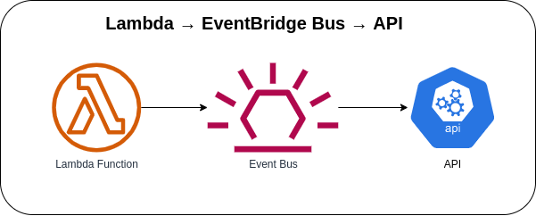

# Lambda → EventBridge Event Bus → EventBridge Rule → API Destination



Invoking the first Lambda function via AWS Console or AWS Console to send a custom event to the EventBridge Bus. The API destination will be triggered with an EventBridge Rule that receives an event from an EventBridge Event Bus. You can create a custom event bus to receive events from your custom applications, or it can receive events from applications and services created by AWS SaaS partners.

**NOTE:** Update the events Connection and Destination configuration on the `event-bridge-api-destination-stack.ts` file.

### Invoking Lambda function via AWS Console
1. Go to Lambda → Lambda Function → ***Test*** tab
2. Update the **Event JSON** textarea field to `{}`
3. Click on the ***Test*** button in the upper right corner

### Invoking Lambda function via AWS CLI
1. Use the following command and replace the placeholder `lambda_function_name` with the actual Lambda function name
    ```bash
    aws lambda invoke \
    --function-name lambda_function_name \
    --payload '{}' \
    response.json
    ```

### Sample Payload sent
```json
{
  "version": "0",
  "id": "123d4567-b891-0e11-b1ed-c2b13141516f",
  "detail-type": "alarm",
  "source": "trigger:alarm",
  "account": "123456789010",
  "time": "2023-05-08T03:51:54Z",
  "region": "us-east-1",
  "resources": [],
  "detail": {
    "request_id": "123d4567-e8ed-9d1d-a011-f121f31415b1",
    "source": "arn:aws:lambda:us-east-1:123456789010:function:lambdaFn",
    "message": "This is a sample alarm message",
    "timestamp": "2023-05-08 03:51:54"
  }
}
```

### AWS CDK API / Developer Reference
* [AWS Lambda](https://docs.aws.amazon.com/cdk/api/v2/docs/aws-cdk-lib.aws_lambda-readme.html)
* [Amazon EventBridge](https://docs.aws.amazon.com/cdk/api/v2/docs/aws-cdk-lib.aws_events-readme.html)
* [Event Targets for Amazon EventBridge](https://docs.aws.amazon.com/cdk/api/v2/docs/aws-cdk-lib.aws_events_targets-readme.html)

### AWS SDK v2 API / Developer Reference
* [AWS Lambda Events](https://github.com/aws/aws-lambda-go/blob/main/events/README.md)
* [Amazon EventBridge](https://pkg.go.dev/github.com/aws/aws-sdk-go-v2/service/eventbridge)
* [Getting Started with the AWS SDK for Go V2](https://aws.github.io/aws-sdk-go-v2/docs/getting-started/)

### AWS Documentation Developer Guide
* [API destinations](https://docs.aws.amazon.com/eventbridge/latest/userguide/eb-api-destinations.html)
* [Using EventBridge](https://docs.aws.amazon.com/AmazonS3/latest/userguide/EventBridge.html)
* [What is Amazon EventBridge](https://docs.aws.amazon.com/eventbridge/latest/userguide/eb-what-is.html)
* [Amazon EventBridge event buses](https://docs.aws.amazon.com/eventbridge/latest/userguide/eb-event-bus.html)
* [Creating an Amazon EventBridge event bus](https://docs.aws.amazon.com/eventbridge/latest/userguide/eb-create-event-bus.html)
* [Sending and receiving Amazon EventBridge events between event buses in the same account and Region](https://docs.aws.amazon.com/eventbridge/latest/userguide/eb-bus-to-bus.html)

### Useful commands

* `npm run build`   compile typescript to js
* `npm run watch`   watch for changes and compile
* `npm run test`    perform the jest unit tests
* `cdk deploy`      deploy this stack to your default AWS account/region
* `cdk diff`        compare deployed stack with current state
* `cdk synth`       emits the synthesized CloudFormation template

## Deploy

### Using make command
1. Install all the dependencies, bootstrap your project, and synthesized CloudFormation template.
  ```bash
  # Without passing "profile" parameter
  dev@dev:~:aws-cdk-samples/event-bridge/event-bridge-api-destination$ make init

  # With "profile" parameter
  dev@dev:~:aws-cdk-samples/event-bridge/event-bridge-api-destination$ make init profile=[profile_name]
  ```

2. Deploy the project.
  ```bash
  # Without passing "profile" parameter
  dev@dev:~:aws-cdk-samples/event-bridge/event-bridge-api-destination$ make deploy

  # With "profile" parameter
  dev@dev:~:aws-cdk-samples/event-bridge/event-bridge-api-destination$ make deploy profile=[profile_name]
  ```