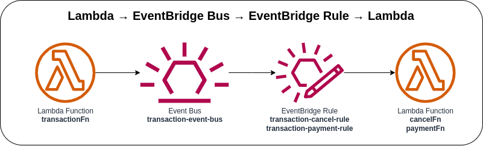

# Lambda → EventBridge Event Bus → EventBridge Rule → Lambda



Invoking the first Lambda function via AWS Console or AWS Console to send a custom event to the EventBridge Bus. The next Lambda function will be triggered with an EventBridge Rule that receives an event from an EventBridge Event Bus. You can create a custom event bus to receive events from your custom applications, or it can receive events from applications and services created by AWS SaaS partners.

### Invoking Lambda function via AWS Console
1. Go to Lambda → Lambda Function → ***Test*** tab
2. Update the Event JSON textarea field (see [sample payload](#sample-payload))
3. Click on the ***Test*** button in the upper right corner

### Invoking Lambda function via AWS CLI
1. Use the following command and replace the placeholder `lambda_function_name` with the actual Lambda function name
    ```bash
    aws lambda invoke \
    --function-name lambda_function_name \
    --payload '{"reference_id": "sample_reference_id", "type": "payment"}' \
    --cli-binary-format raw-in-base64-out \
    response.json
    ```

### Sample Payload
* **Payment Transaction**
    ```json
    {
      "reference_id": "sample_reference_id",
      "type": "payment"
    }
    ```

* **Cancel Transaction**
    ```json
    {
      "reference_id": "sample_reference_id",
      "type": "cancel"
    }
    ```

### Sample Event Logs

* **Payment Transaction**
    ```json
    {
      "log_code": "PaymentEvent",
      "log_msg": "Transaction Payment Event",
      "log_level": "INFO",
      "log_keys": {
        "event": {
          "version": "0",
          "id": "1b23456d-78ff-b91f-0111-21c3e1415161",
          "detail-type": "transaction",
          "source": "transaction:payment",
          "account": "123456789010",
          "time": "2023-05-05T04:20:48Z",
          "region": "us-east-1",
          "resources": [],
          "detail": {
            "reference_id": "sample_reference_id",
            "type": "payment",
            "timestamp": "2023-05-05 04:20:48"
          }
        }
      },
      "log_timestamp": "2023-05-05 04:20:49"
    }
    ```

* **Cancel Transaction**
    ```json
    {
      "log_code": "CancelEvent",
      "log_msg": "Transaction Cancel Event",
      "log_level": "INFO",
      "log_keys": {
        "event": {
          "version": "0",
          "id": "1b23456d-78ff-b91f-0111-21c3e1415161",
          "detail-type": "transaction",
          "source": "transaction:cancel",
          "account": "123456789010",
          "time": "2023-05-05T04:21:28Z",
          "region": "us-east-1",
          "resources": [],
          "detail": {
            "reference_id": "sample_reference_id",
            "type": "cancel",
            "timestamp": "2023-05-05 04:21:28"
          }
        }
      },
      "log_timestamp": "2023-05-05 04:21:29"
    }
    ```

### AWS CDK API / Developer Reference
* [AWS Lambda](https://docs.aws.amazon.com/cdk/api/v2/docs/aws-cdk-lib.aws_lambda-readme.html)
* [Amazon EventBridge](https://docs.aws.amazon.com/cdk/api/v2/docs/aws-cdk-lib.aws_events-readme.html)
* [Amazon EventBridge CronOption](https://docs.aws.amazon.com/cdk/api/v2/docs/aws-cdk-lib.aws_events.CronOptions.html)
* [Event Targets for Amazon EventBridge](https://docs.aws.amazon.com/cdk/api/v2/docs/aws-cdk-lib.aws_events_targets-readme.html)

### AWS SDK v2 API / Developer Reference
* [AWS Lambda Events](https://github.com/aws/aws-lambda-go/blob/main/events/README.md)
* [Amazon EventBridge](https://pkg.go.dev/github.com/aws/aws-sdk-go-v2/service/eventbridge)
* [Getting Started with the AWS SDK for Go V2](https://aws.github.io/aws-sdk-go-v2/docs/getting-started/)

### AWS Documentation Developer Guide
* [Using EventBridge](https://docs.aws.amazon.com/AmazonS3/latest/userguide/EventBridge.html)
* [What is Amazon EventBridge](https://docs.aws.amazon.com/eventbridge/latest/userguide/eb-what-is.html)
* [Amazon EventBridge event buses](https://docs.aws.amazon.com/eventbridge/latest/userguide/eb-event-bus.html)
* [Creating an Amazon EventBridge event bus](https://docs.aws.amazon.com/eventbridge/latest/userguide/eb-create-event-bus.html)
* [Sending and receiving Amazon EventBridge events between event buses in the same account and Region](https://docs.aws.amazon.com/eventbridge/latest/userguide/eb-bus-to-bus.html)

### Useful commands

* `npm run build`   compile typescript to js
* `npm run watch`   watch for changes and compile
* `npm run test`    perform the jest unit tests
* `cdk deploy`      deploy this stack to your default AWS account/region
* `cdk diff`        compare deployed stack with current state
* `cdk synth`       emits the synthesized CloudFormation template

## Deploy

### Using make command
1. Install all the dependencies, bootstrap your project, and synthesized CloudFormation template.
  ```bash
  # Without passing "profile" parameter
  dev@dev:~:aws-cdk-samples/event-bridge/event-bridge-bus-lambda$ make init

  # With "profile" parameter
  dev@dev:~:aws-cdk-samples/event-bridge/event-bridge-bus-lambda$ make init profile=[profile_name]
  ```

2. Deploy the project.
  ```bash
  # Without passing "profile" parameter
  dev@dev:~:aws-cdk-samples/event-bridge/event-bridge-bus-lambda$ make deploy

  # With "profile" parameter
  dev@dev:~:aws-cdk-samples/event-bridge/event-bridge-bus-lambda$ make deploy profile=[profile_name]
  ```