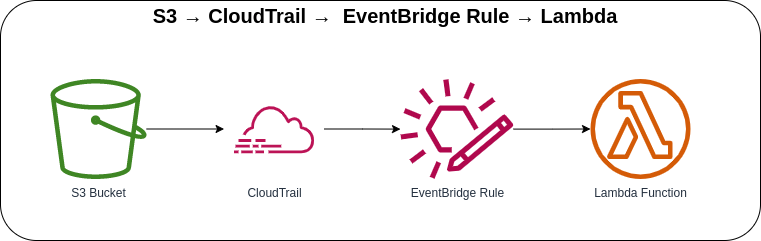

# S3 → CloudTrail →  EventBridge Rule → Lambda



Invoking the Lambda function with EventBridge Rule if there is any `PutObject` event(s) received from the S3 Bucket. The EventBridge consumes S3 events via AWS CloudTrail. Once the CloudTrail is configured, EventBridge can receive a `PutObject` logged in the Trail. When the Lambda Function receives an event from the EventBridge Rule, it will log the S3 Event information in the CloudWatch Logs.

**NOTE**: Update the `bucketArn` in the `event-bridge-rule-lambda-stack.ts` on the **lib/stacks** folder.

### Sample S3 PutObject Event Log
```json
{
  "log_code": "S3Event",
  "log_msg": "S3 PutObject Event",
  "log_level": "INFO",
  "log_keys": {
    "event": {
      "version": "0",
      "id": "a6b1c8d2-e657-3f0a-5900-72b3c1def1ab",
      "detail-type": "AWS API Call via CloudTrail",
      "source": "aws.s3",
      "account": "xxxxxxxxxxxxx",
      "time": "2023-05-02T08:37:52Z",
      "region": "us-east-1",
      "resources": [],
      "detail": {
        "eventVersion": "1.08",
        "userIdentity": {
          "type": "xxxxx",
          "principalId": "xxxxxxxxxxxxx",
          "arn": "arn:aws:iam::xxxxxxxxxxxxx:xxxxx",
          "accountId": "xxxxxxxxxxxxx",
          "accessKeyId": "XXXXXXXXXXXXXXXXXX",
          "userName": "aws-cloud-cdk-samples",
          "sessionContext": {
            "attributes": {
              "creationDate": "2023-05-02T02:52:46Z",
              "mfaAuthenticated": "true"
            }
          }
        },
        "eventTime": "2023-05-02T08:37:52Z",
        "eventSource": "s3.amazonaws.com",
        "eventName": "PutObject",
        "awsRegion": "us-east-1",
        "sourceIPAddress": "xxx.xxx.xxx.xxx",
        "userAgent": "[Mozilla/5.0 (X11; Linux x86_64) AppleWebKit/537.36 (KHTML, like Gecko) Chrome/112.0.0.0 Safari/537.36]",
        "requestParameters": {
          "X-Amz-Date": "20230502T083750Z",
          "bucketName": "your-bucket-name-us-east-1",
          "X-Amz-Algorithm": "AWS4-HMAC-SHA256",
          "x-amz-acl": "bucket-owner-full-control",
          "X-Amz-SignedHeaders": "content-md5;content-type;host;x-amz-acl;x-amz-storage-class",
          "Host": "your-bucket-name-us-east-1.s3.us-east-1.amazonaws.com",
          "X-Amz-Expires": "300",
          "key": "sample-image.jpg",
          "x-amz-storage-class": "STANDARD"
        },
        "responseElements": {
          "x-amz-server-side-encryption": "AES256"
        },
        "additionalEventData": {
          "SignatureVersion": "SigV4",
          "CipherSuite": "ECDHE-RSA-AES128-GCM-SHA256",
          "bytesTransferredIn": 1234567,
          "SSEApplied": "Default_SSE_S3",
          "AuthenticationMethod": "QueryString",
          "x-amz-id-2": "xxxxxxxxxxxxxxxxxxxxxxxxxxxxxxxxxxxxxxxxxxxxxxxxxxxx",
          "bytesTransferredOut": 0
        },
        "requestID": "Z01XC2VBNMA3SDF4",
        "eventID": "123ab45c-d6e7-8f9a-1011-121b3c14d1e5",
        "readOnly": false,
        "resources": [
          {
            "type": "AWS::S3::Object",
            "ARN": "arn:aws:s3:::your-bucket-name-us-east-1/sample-image.jpg"
          },
          {
            "accountId": "xxxxxxxxxxxxx",
            "type": "AWS::S3::Bucket",
            "ARN": "arn:aws:s3:::your-bucket-name-us-east-1"
          }
        ],
        "eventType": "AwsApiCall",
        "managementEvent": false,
        "recipientAccountId": "xxxxxxxxxxxxx",
        "eventCategory": "Data",
        "tlsDetails": {
          "tlsVersion": "TLSv1.2",
          "cipherSuite": "ECDHE-RSA-AES128-GCM-SHA256",
          "clientProvidedHostHeader": "your-bucket-name-us-east-1.s3.us-east-1.amazonaws.com"
        }
      }
    }
  },
  "log_timestamp": "2023-05-02 08:37:58"
}
```

### AWS CDK API / Developer Reference
* [AWS Lambda](https://docs.aws.amazon.com/cdk/api/v2/docs/aws-cdk-lib.aws_lambda-readme.html)
* [Amazon EventBridge](https://docs.aws.amazon.com/cdk/api/v2/docs/aws-cdk-lib.aws_events-readme.html)
* [Event Targets for Amazon EventBridge](https://docs.aws.amazon.com/cdk/api/v2/docs/aws-cdk-lib.aws_events_targets-readme.html)

### AWS SDK v2 API / Developer Reference
* [AWS Lambda Events](https://github.com/aws/aws-lambda-go/blob/main/events/README.md)
* [S3 Service Documentation](https://pkg.go.dev/github.com/aws/aws-sdk-go-v2/service/s3)
* [Getting Started with the AWS SDK for Go V2](https://aws.github.io/aws-sdk-go-v2/docs/getting-started/)

### AWS Documentation Developer Guide
* [Using EventBridge](https://docs.aws.amazon.com/AmazonS3/latest/userguide/EventBridge.html)
* [What is Amazon EventBridge](https://docs.aws.amazon.com/eventbridge/latest/userguide/eb-what-is.html)
* [Using dynamic Amazon S3 event handling with Amazon EventBridge](https://aws.amazon.com/blogs/compute/using-dynamic-amazon-s3-event-handling-with-amazon-eventbridge/)
* [Creating Amazon EventBridge rules that react to events](https://docs.aws.amazon.com/eventbridge/latest/userguide/eb-create-rule.html)

### Useful commands

* `npm run build`   compile typescript to js
* `npm run watch`   watch for changes and compile
* `npm run test`    perform the jest unit tests
* `cdk deploy`      deploy this stack to your default AWS account/region
* `cdk diff`        compare deployed stack with current state
* `cdk synth`       emits the synthesized CloudFormation template

## Deploy

### Using make command
1. Install all the dependencies, bootstrap your project, and synthesized CloudFormation template.
    ```bash
    # Without passing "profile" parameter
    dev@dev:~:aws-cdk-samples/event-bridge/event-bridge-rule-lambda$ make init

    # With "profile" parameter
    dev@dev:~:aws-cdk-samples/event-bridge/event-bridge-rule-lambda$ make init profile=[profile_name]
    ```

2. Deploy the project.
    ```bash
    # Without passing "profile" parameter
    dev@dev:~:aws-cdk-samples/event-bridge/event-bridge-rule-lambda$ make deploy

    # With "profile" parameter
    dev@dev:~:aws-cdk-samples/event-bridge/event-bridge-rule-lambda$ make deploy profile=[profile_name]
    ```