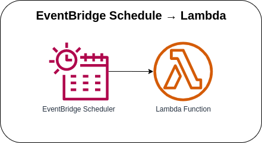

# S3 → CloudTrail →  EventBridge Rule → Lambda



Invoking the Lambda function with EventBridge Rule Schedule. You can create rules that run on a schedule by using `cron` or `rate` expressions. All scheduled events use ***UTC+0*** timezone, and the minimum precision for a schedule is ***one minute***.

### Rate Expressions
A *`rate` expression* starts when you create the scheduled event rule, and then it runs on a defined scheduled.

#### Example
The `rule` will trigger the `target` every thirty (30) minutes.

```typescript
const rule = new events.Rule(this, 'schedule-rule', {
  ruleName: 'schedule-rule',
  enabled: true,
  targets: [ new LambdaFunction(lambdaFn) ],
  schedule: events.Schedule.rate(cdk.Duration.minutes(30))
});
```

### Cron Expressions
The *`cron` expressions* have six required fields, which are separated by white space.

<table>
  <thead>
    <th>Field</th>
    <th>Values</th>
    <th>Wildcards</th>
  </thead>
  <tbody>
    <tr>
      <td>Minutes</td>
      <td>0-59</td>
      <td>, - * / </td>
    </tr>
    <tr>
      <td>Hours</td>
      <td>0-23</td>
      <td>, - * /</td>
    </tr>
    <tr>
      <td>Day-of-month</td>
      <td>1-31</td>
      <td>, - * ? / L W</td>
    </tr>
    <tr>
      <td>Month</td>
      <td>1-12 or JAN-DEC</td>
      <td>, - * / </td>
    </tr>
    <tr>
      <td>Day-of-week</td>
      <td>1-7 or SUN-SAT</td>
      <td>, - * ? L #</td>
    </tr>
    <tr>
      <td>Year</td>
      <td>1970-2199</td>
      <td>, - * / </td>
    </tr>
  </tbody>
</table>

#### Example
The `rule` will trigger the `target` every one (1) minute between 8:00AM and 9:00PM (PH Time).


* Using `expression`:
    ```typescript
    const scheduleRule = new events.Rule(this, 'schedule-rule', {
      ruleName: 'schedule-rule',
      enabled: true,
      targets: [ new LambdaFunction(lambdaFn) ],
      schedule: events.Schedule.expression('cron(0/1 2-21 ? * * *)')
    });
    ```

* Using `cron`:
    ```typescript
    const scheduleRule = new events.Rule(this, 'schedule-rule', {
      ruleName: 'schedule-rule',
      enabled: true,
      targets: [ new LambdaFunction(lambdaFn) ],
      schedule: events.Schedule.cron({ minute: '0/1', hour: '2-21' })
    });
    ```

### AWS CDK API / Developer Reference
* [AWS Lambda](https://docs.aws.amazon.com/cdk/api/v2/docs/aws-cdk-lib.aws_lambda-readme.html)
* [Amazon EventBridge](https://docs.aws.amazon.com/cdk/api/v2/docs/aws-cdk-lib.aws_events-readme.html)
* [Amazon EventBridge CronOption](https://docs.aws.amazon.com/cdk/api/v2/docs/aws-cdk-lib.aws_events.CronOptions.html)
* [Event Targets for Amazon EventBridge](https://docs.aws.amazon.com/cdk/api/v2/docs/aws-cdk-lib.aws_events_targets-readme.html)

### AWS SDK v2 API / Developer Reference
* [AWS Lambda Events](https://github.com/aws/aws-lambda-go/blob/main/events/README.md)
* [S3 Service Documentation](https://pkg.go.dev/github.com/aws/aws-sdk-go-v2/service/s3)
* [Getting Started with the AWS SDK for Go V2](https://aws.github.io/aws-sdk-go-v2/docs/getting-started/)

### AWS Documentation Developer Guide
* [Using EventBridge](https://docs.aws.amazon.com/AmazonS3/latest/userguide/EventBridge.html)
* [What is Amazon EventBridge](https://docs.aws.amazon.com/eventbridge/latest/userguide/eb-what-is.html)
* [Creating an Amazon EventBridge rule that runs on a schedule](https://docs.aws.amazon.com/eventbridge/latest/userguide/eb-create-rule-schedule.html)

### Useful commands

* `npm run build`   compile typescript to js
* `npm run watch`   watch for changes and compile
* `npm run test`    perform the jest unit tests
* `cdk deploy`      deploy this stack to your default AWS account/region
* `cdk diff`        compare deployed stack with current state
* `cdk synth`       emits the synthesized CloudFormation template

## Deploy

### Using make command
1. Install all the dependencies, bootstrap your project, and synthesized CloudFormation template.
  ```bash
  # Without passing "profile" parameter
  dev@dev:~:aws-cdk-samples/event-bridge/event-bridge-schedule-lambda$ make init

  # With "profile" parameter
  dev@dev:~:aws-cdk-samples/event-bridge/event-bridge-schedule-lambda$ make init profile=[profile_name]
  ```

2. Deploy the project.
  ```bash
  # Without passing "profile" parameter
  dev@dev:~:aws-cdk-samples/event-bridge/event-bridge-schedule-lambda$ make deploy

  # With "profile" parameter
  dev@dev:~:aws-cdk-samples/event-bridge/event-bridge-schedule-lambda$ make deploy profile=[profile_name]
  ```