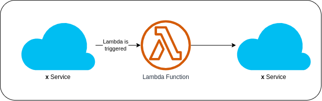

# What is AWS Lambda?

**AWS Lambda** is a compute service that lets you run code without provisioning or managing servers. Lambda runs your code on high-availability compute infrastructure and performs all the administration of the compute resources, including server and operating system maintenance, capacity provisioning and automatic scaling, and logging. With Lambda, all you need to do is supply your code in one of the language rutimes that Lambda supports.

Users of AWS Lambda create functions, self-contained applications written in one of the supported languages and runtimes, and upload them to AWS Lambda, which executes those functions in an efficient and flexible manner. The Lambda functions can perform any kind of computing task, from serving web pages and processing streams of data to calling APIs and integrating with other AWS services.

AWS Lambda is the event-based serverless computing service for the AWS platform. Event-driven functions are compute events that happen automatically in response to various inputs known as triggers. This is sometimes called *Functions-as-a-Service (FaaS)*, though the AWS Lambda ecosystem extends beyond that.

### Serverless Computing
Serverless computing allows you to build and run applications and services without thinking about servers. With serverless computing, your application still run on servers, but all the server management is done by AWS. Using AWS and its Serverless Platform, you can build and deploy applications in cost-effective services that provide built-in application availability and flexible scaling capabilities. This lets you focus on your application code instead of worrying about provisioning, configuring, and managing servers.

#### Main benfits
* **No server management**
There is no need to provision or maintain any servers. There is no software or runtime to install, maintain, or administer.

* **Flexible scaling**
Your application can be scaled automatically or by adjusting its capacity through toggling the units of consumption (throughput, memory) rather than units of individual servers.

* **High availability**
Serverless applications have built-in availability and  fault tolerance. You do not need to architect for these capabilities since the services running the application provide them by default

* **No idle capacity**
You do not have to pay for idle capacity. There is no need to pre-or over-provision capacity for things like compute and storage. For example, there is no charge when your code is not running.

## Benefits of using AWS Lambda
### Pay per use
In AWS Lambda, you pay only for the compute your functions use, plus any network traffic generated. For workloads that scale significantly according to time of day, this type of billing is generally more cost-effective.

### Fully managed infrastructure
 Now that your functions run on the managed AWS infrastructure, you don’t need to think about the underlying servers—AWS takes care of this for you. This can result in significant savings on operational tasks such as upgrading the operating system or managing the network layer.

### Automatic scaling
 AWS Lambda creates the instances of your function as they are requested. There is no pre-scaled pool, no scale levels to worry about, no settings to tune—and at the same time your functions are available whenever the load increases or decreases. You only pay for each function’s run time.

### Tight integration with othe AWS products
AWS Lambda integrates with services like DynamoDB, S3 and API Gateway, allowing you to build functionally complete applications within your Lambda functions.

## Use cases of AWS Lambda
### Process data at scale
Execute code at the capacity you need, as you need it. Scale to match your data volume automatically and enable custom event triggers.

### Run interactive web and mobile backends
Combine AWS Lambda with other AWS services to create secure, stable, and scalable online experiences.

### Enable powerful ML insights
Preprocess data before feeding it to your machine learning (ML) model. With Amazon Elastic File System (EFS) access, AWS Lambda handles infrastructure management and provisioning to simplify scaling.

### Create event-driven applications
Build event-driven functions for easy communication between decoupled services. Reduce costs by running applications during times of peak demand without crashing or over-provisioning resources.

## Reference
* [AWS Lambda](https://aws.amazon.com/lambda/)
* [Lambda runtimes](https://docs.aws.amazon.com/lambda/latest/dg/lambda-runtimes.html)
* [AWS Lambda FAQs](https://aws.amazon.com/lambda/faqs/)
* [What is AWS Lambda?](https://docs.aws.amazon.com/lambda/latest/dg/welcome.html)
* [Serverless Web Application](https://aws.amazon.com/serverless/build-a-web-app/)
* [Serverless - What is AWS Lambda?](https://www.serverless.com/aws-lambda)
* [What Is AWS Lambda? A Straightforward, No BS Guide](https://www.cloudzero.com/blog/aws-lambda)