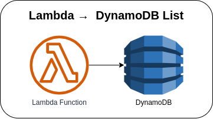

# Lambda →  DynamoDB List



Invoking the Lambda function manually via AWS Console or AWS CLI to create an order with an order line(s) that will insert/update the item to the DynamoDB table.

**NOTE**: The project is currently using an AWS SDK v2 function. However, if you prefer to use the AWS SDK v1, I have provided an implementation that uses AWS SDK v1. You may check the [`dynamodb_v1.go`](internal/aws_wrapper/dynamodb_v1.go) for the AWS SDK v1 and for the checking of the existing order line can be found on [`get_item.go`](internal/common/get_item.go) with a function called **`ExistingOrderLineV1`**.

### Invoking Lambda function via AWS Console
1. Go to Lambda → Lambda Function → ***Test*** tab
2. Update the **Event JSON** textarea field (see [sample payload](#sample-payload))
3. Click on the **Test** button in the upper right corner

### Invoking Lambda function via AWS CLI
1. Use the following command and replace the placeholder `lambda_function_name` with the actual Lambda function name

    ```bash
    aws lambda invoke \
    --function-name lambda_function_name \
    --payload '{"referenceId": "sample-referenceId-12345", "order_line": [{"item_id": "sample-item-12345", "price": 15.20, "quantity": 5}, {"item_id": "sample-item-67890", "price": 50.75, "quantity": 10}]}' \
    response.json
    ```

### Sample Payload
```json
{
  "referenceId": "sample-referenceId-12345",
  "order_line": [
    {
      "item_id": "sample-item-12345",
      "price": 15.20,
      "quantity": 5
    },
    {
      "item_id": "sample-item-67890",
      "price": 50.75,
      "quantity": 10
    }
  ]
}
```

### AWS CDK API / Developer Reference
* [AWS Lambda](https://docs.aws.amazon.com/cdk/api/v2/docs/aws-cdk-lib.aws_lambda-readme.html)
* [AWS DynamoDB](https://docs.aws.amazon.com/cdk/api/v2/docs/aws-cdk-lib.aws_dynamodb-readme.html)
* [AWS Lambda Event Sources](https://docs.aws.amazon.com/cdk/api/v2/docs/aws-cdk-lib.aws_lambda_event_sources-readme.html)

### AWS SDK v2 API / Developer Reference
* [AWS Lambda Events](https://github.com/aws/aws-lambda-go/blob/main/events/README.md)
* [DynamoDB Service Documentation](https://pkg.go.dev/github.com/aws/aws-sdk-go-v2/service/dynamodb)
* [Getting Started with the AWS SDK for Go V2](https://aws.github.io/aws-sdk-go-v2/docs/getting-started/)

### AWS Documentation Developer Guide
* [Update expressions](https://docs.aws.amazon.com/amazondynamodb/latest/developerguide/Expressions.UpdateExpressions.html)
* [Reserved words in DynamoDB](https://docs.aws.amazon.com/amazondynamodb/latest/developerguide/ReservedWords.html)
* [How to add item to a dynamodb list](https://gist.github.com/wliao008/e0dba6a3cf089d46932d39b90f9d838f)
* [Core components of Amazon DynamoDB](https://docs.aws.amazon.com/amazondynamodb/latest/developerguide/HowItWorks.CoreComponents.html)
* [Using AWS Lambda with Amazon DynamoDB](https://docs.aws.amazon.com/lambda/latest/dg/with-ddb.html)
* [Best practices for designing and using partition keys effectively](https://docs.aws.amazon.com/amazondynamodb/latest/developerguide/bp-partition-key-design.html)
* [How to add an attribute to the dynamoDB table item if it does not exist and add value to that attribute?](https://stackoverflow.com/questions/66141400/how-to-add-an-attribute-to-the-dynamodb-table-item-if-it-does-not-exist-and-add)

### Useful commands

* `npm run build`   compile typescript to js
* `npm run watch`   watch for changes and compile
* `npm run test`    perform the jest unit tests
* `cdk deploy`      deploy this stack to your default AWS account/region
* `cdk diff`        compare deployed stack with current state
* `cdk synth`       emits the synthesized CloudFormation template

## Deploy

### Using make command
1. Install all the dependencies, bootstrap your project, and synthesized CloudFormation template.
    ```bash
    # Without passing "profile" parameter
    dev@dev:~:aws-cdk-samples/lambda/lambda-dynamodb-list$ make init

    # With "profile" parameter
    dev@dev:~:aws-cdk-samples/lambda/lambda-dynamodb-list$ make init profile=[profile_name]
    ```

2. Deploy the project.
    ```bash
    # Without passing "profile" parameter
    dev@dev:~:aws-cdk-samples/lambda/lambda-dynamodb-list$ make deploy

    # With "profile" parameter
    dev@dev:~:aws-cdk-samples/lambda/lambda-dynamodb-list$ make deploy profile=[profile_name]
    ```

