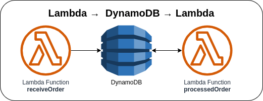

# Lambda →  DynamoDB → Lambda



Invoking the first Lambda function manually via AWS Console or AWS CLI to create an order that will be saved into the DynamoDB table. The second Lambda function will be triggered if there's a new record from the stream that contains the stream records. The second Lambda function will process the received record and update the `status` attribute.

### Invoking Lambda function via AWS Console
1. Go to Lambda → Lambda Function → ***Test*** tab
2. Update the **Event JSON** textarea field to `{}`
3. Click on the **Test** button in the upper right corner

### Invoking Lambda function via AWS CLI
1. Use the following command and replace the placeholder `lambda_function_name` with the actual Lambda function name

    ```bash
    aws lambda invoke \
    --function-name lambda_function_name \
    --payload '{}' \
    response.json
    ```

### AWS CDK API / Developer Reference
* [AWS Lambda](https://docs.aws.amazon.com/cdk/api/v2/docs/aws-cdk-lib.aws_lambda-readme.html)
* [AWS DynamoDB](https://docs.aws.amazon.com/cdk/api/v2/docs/aws-cdk-lib.aws_dynamodb-readme.html)
* [AWS Lambda Event Sources](https://docs.aws.amazon.com/cdk/api/v2/docs/aws-cdk-lib.aws_lambda_event_sources-readme.html)

### AWS SDK v2 API / Developer Reference
* [AWS Lambda Events](https://github.com/aws/aws-lambda-go/blob/main/events/README.md)
* [DynamoDB Service Documentation](https://pkg.go.dev/github.com/aws/aws-sdk-go-v2/service/dynamodb)
* [Getting Started with the AWS SDK for Go V2](https://aws.github.io/aws-sdk-go-v2/docs/getting-started/)

### AWS Documentation Developer Guide
* [Core components of Amazon DynamoDB](https://docs.aws.amazon.com/amazondynamodb/latest/developerguide/HowItWorks.CoreComponents.html)
* [Using AWS Lambda with Amazon DynamoDB](https://docs.aws.amazon.com/lambda/latest/dg/with-ddb.html)
* [Best practices for designing and using partition keys effectively](https://docs.aws.amazon.com/amazondynamodb/latest/developerguide/bp-partition-key-design.html)

### Useful commands

* `npm run build`   compile typescript to js
* `npm run watch`   watch for changes and compile
* `npm run test`    perform the jest unit tests
* `cdk deploy`      deploy this stack to your default AWS account/region
* `cdk diff`        compare deployed stack with current state
* `cdk synth`       emits the synthesized CloudFormation template

## Deploy

### Using make command
1. Install all the dependencies, bootstrap your project, and synthesized CloudFormation template.
    ```bash
    # Without passing "profile" parameter
    dev@dev:~:aws-cdk-samples/lambda/lambda-dynamodb$ make init

    # With "profile" parameter
    dev@dev:~:aws-cdk-samples/lambda/lambda-dynamodb$ make init profile=[profile_name]
    ```

2. Deploy the project.
    ```bash
    # Without passing "profile" parameter
    dev@dev:~:aws-cdk-samples/lambda/lambda-dynamodb$ make deploy

    # With "profile" parameter
    dev@dev:~:aws-cdk-samples/lambda/lambda-dynamodb$ make deploy profile=[profile_name]
    ```
