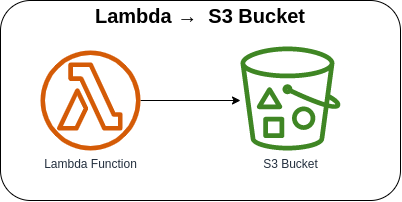

# Lambda → S3



Invoking the Lambda function via AWS Console or AWS CLI to either create an order, get the object data, or delete the object from the S3 Bucket.

### Invoking Lambda function via AWS Console
1. Go to Lambda → Lambda Function → ***Test*** tab
2. Update the Event JSON textarea field (see [sample payload](#sample-payload))
3. Click on the Test button in the upper right corner

### Invoking Lambda function via AWS CLI
1. Use the following command and replace the placeholder `lambda_function_name` with the actual Lambda function name

    ```bash
    aws lambda invoke \
    --function-name lambda_function_name \
    --payload '{"action": "put", "key": "sample-1.json", "quantity": 1, "order": { "referenceId": "SMPLORDR-1234567890", "item": [{ "id": "SMPLITM-12345", "name": "Sample Item", "price": 1234.50 }]}
    }' \
    --cli-binary-format raw-in-base64-out \
    response.json
    ```

#### Sample Payload

* **Create a new object**
    ```json
    {
      "action": "put",
      "key": "sample-1.json",
      "quantity": 1,
      "order": {
        "referenceId": "SMPLORDR-1234567890",
        "item": [{
            "id": "SMPLITM-12345",
            "name": "Sample Item",
            "price": 1234.50
        }]
      }
    }
    ```

* **Retrieve object data**
    ```json
    {
      "action": "get",
      "key": "sample-1.json"
    }
    ```

* **Delete object**
    ```json
    {
      "action": "delete",
      "key": "sample-1.json"
    }
    ```

### AWS CDK API / Developer Reference
* [Amazon S3](https://docs.aws.amazon.com/cdk/api/v2/docs/aws-cdk-lib.aws_s3-readme.html)
* [AWS Lambda](https://docs.aws.amazon.com/cdk/api/v2/docs/aws-cdk-lib.aws_lambda-readme.html)

### AWS SDK v2 API / Developer Reference
* [S3 Service Documentation](https://pkg.go.dev/github.com/aws/aws-sdk-go-v2/service/s3)
* [Getting Started with the AWS SDK for Go V2](https://aws.github.io/aws-sdk-go-v2/docs/getting-started/)

### AWS Documentation Developer Guide
* [Bucket restrictions and limitations](https://docs.aws.amazon.com/AmazonS3/latest/userguide/BucketRestrictions.html)
* [How can I resolve the "Bucket name already exists" or "BucketAlreadyExists" error from Amazon S3?](https://repost.aws/knowledge-center/s3-error-bucket-already-exists)

### Useful commands

* `npm run build`   compile typescript to js
* `npm run watch`   watch for changes and compile
* `npm run test`    perform the jest unit tests
* `cdk deploy`      deploy this stack to your default AWS account/region
* `cdk diff`        compare deployed stack with current state
* `cdk synth`       emits the synthesized CloudFormation template

## Deploy

### Using make command
1. Install all the dependencies, bootstrap your project, and synthesized CloudFormation template.
  ```bash
  # Without passing "profile" parameter
  dev@dev:~:aws-cdk-samples/lambda/lambda-s3$ make init

  # With "profile" parameter
  dev@dev:~:aws-cdk-samples/lambda/lambda-s3$ make init profile=[profile_name]
  ```

2. Deploy the project.
  ```bash
  # Without passing "profile" parameter
  dev@dev:~:aws-cdk-samples/lambda/lambda-s3$ make deploy

  # With "profile" parameter
  dev@dev:~:aws-cdk-samples/lambda/lambda-s3$ make deploy profile=[profile_name]
  ```