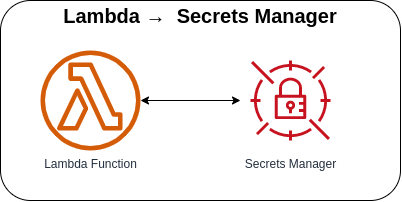

# Lambda → Secrets Manager



Invoking the Lambda function via AWS Console or AWS CLI to create a request to the Secrets Manager to either retrieve or update the Secret Value.

**NOTE**: When the stack is being deployed, please remember that it will automatically generate a default secret value if not initialized.

### Invoking Lambda function via AWS Console
1. Go to Lambda → Lambda Function → Test tab
2. Update the Event JSON textarea field (see [sample payload](#sample-payload))
3. Click on the Test button in the upper right corner

### Invoking Lambda function via AWS CLI
1. Use the following command and replace the placeholder `lambda_function_name` with the actual Lambda function name

    ```bash
    aws lambda invoke \
    --function-name lambda_function_name \
    --payload '{"action": "update", "secret": {"username": "john.doe", "password": "john.doe.123", "email": "john.doe@email.com"}}' \
    --cli-binary-format raw-in-base64-out \
    response.json
    ```

#### Sample Payload

* **Updating Secret Value**
    ```json
    {
      "action": "update",
      "secret": {
        "username": "john.doe",
        "password": "john.doe.123",
        "email": "john.doe@email.com"
      }
    }
    ```

* **Retrieving Secret Value**
    ```json
    {
      "action": "get"
    }
    ```

### AWS CDK API / Developer Reference
* [AWS Lambda](https://docs.aws.amazon.com/cdk/api/v2/docs/aws-cdk-lib.aws_lambda-readme.html)
* [AWS Secrets Manager](https://docs.aws.amazon.com/cdk/api/v2/docs/aws-cdk-lib.aws_secretsmanager-readme.html)

### AWS SDK v2 API / Developer Reference
* [Secrets Manager Service Documentation](https://pkg.go.dev/github.com/aws/aws-sdk-go-v2/service/secretsmanager)
* [Getting Started with the AWS SDK for Go V2](https://aws.github.io/aws-sdk-go-v2/docs/getting-started/)

### AWS Documentation Developer Guide
* [Securely retrieving secrets with AWS Lambda](https://aws.amazon.com/blogs/compute/securely-retrieving-secrets-with-aws-lambda/)
* [Use AWS Secrets Manager secrets in AWS Lambda functions](https://docs.aws.amazon.com/secretsmanager/latest/userguide/retrieving-secrets_lambda.html)
* [Best practices for designing and using partition keys effectively](https://docs.aws.amazon.com/amazondynamodb/latest/developerguide/bp-partition-key-design.html)

### Useful commands

* `npm run build`   compile typescript to js
* `npm run watch`   watch for changes and compile
* `npm run test`    perform the jest unit tests
* `cdk deploy`      deploy this stack to your default AWS account/region
* `cdk diff`        compare deployed stack with current state
* `cdk synth`       emits the synthesized CloudFormation template

## Deploy

### Using make command
1. Install all the dependencies, bootstrap your project, and synthesized CloudFormation template.
  ```bash
  # Without passing "profile" parameter
  dev@dev:~:aws-cdk-samples/lambda/lambda-secretsmanager$ make init

  # With "profile" parameter
  dev@dev:~:aws-cdk-samples/lambda/lambda-secretsmanager$ make init profile=[profile_name]
  ```

2. Deploy the project.
  ```bash
  # Without passing "profile" parameter
  dev@dev:~:aws-cdk-samples/lambda/lambda-secretsmanager$ make deploy

  # With "profile" parameter
  dev@dev:~:aws-cdk-samples/lambda/lambda-secretsmanager$ make deploy profile=[profile_name]
  ```