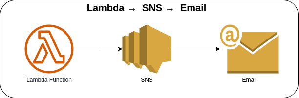
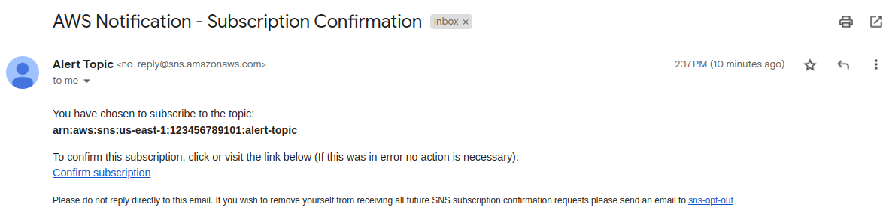
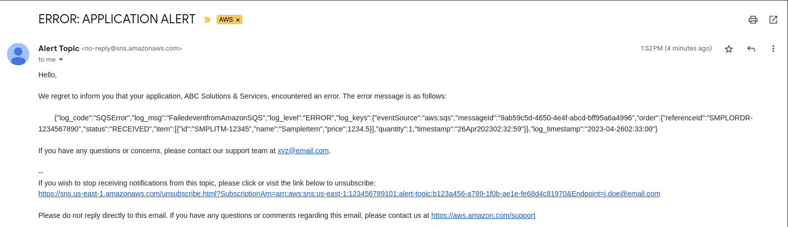

# Lambda → SNS



Invoking the Lambda function via AWS Console or AWS CLI to subscribe or publish a message to the Simple Notification Service to send an email.

**NOTE**: Update the email subscription endpoint in the `lambda-sns-stack.ts` file inside the **`lib/stacks`** folder.

### Invoking Lambda function via AWS Console
1. Go to Lambda → Lambda Function → Test tab
2. Update the Event JSON textarea field (see [sample payload](#sample-payload))
3. Click on the Test button in the upper right corner

### Invoking Lambda function via AWS CLI
1. Use the following command and replace the placeholder `lambda_function_name` with the actual Lambda function name

    ```bash
    aws lambda invoke \
    --function-name lambda_function_name \
    --payload '{"action": "subscribe", "content": { "user": { "name": "John Doe", "email": "j.doe@email.com" }}}' \
    --cli-binary-format raw-in-base64-out \
    response.json
    ```

#### Sample Payload

* **Subscribing to the SNS Topic**

    ```json
    {
      "action": "subscribe",
      "content": {
        "user": {
          "name": "John Doe",
          "email": "j.doe@email.com"
        }
      }
    }
    ```

    

* **Publishing a message to the SNS Topic**

    ```json
    {
      "action": "alert",
      "content": {
        "application": "ABC Solutions & Services",
        "message": "{\"log_code\":\"SQSError\",\"log_msg\":\"FailedeventfromAmazonSQS\",\"log_level\":\"ERROR\",\"log_keys\":{\"eventSource\":\"aws:sqs\",\"messageId\":\"9ab59c5d-4650-4e4f-abcd-bff95a6a4996\",\"order\":{\"referenceId\":\"SMPLORDR-1234567890\",\"status\":\"RECEIVED\",\"item\":[{\"id\":\"SMPLITM-12345\",\"name\":\"SampleItem\",\"price\":1234.5}],\"quantity\":1,\"timestmap\":\"2023-04-2602:32:59\"}},\"log_timestamp\":\"2023-04-2602:33:00\"}"
      }
    }
    ```

    

### AWS CDK API / Developer Reference
* [AWS Lambda](https://docs.aws.amazon.com/cdk/api/v2/docs/aws-cdk-lib.aws_lambda-readme.html)
* [Amazon Simple Notification Service](https://docs.aws.amazon.com/cdk/api/v2/docs/aws-cdk-lib.aws_sns-readme.html)
* [Amazon Simple Notification Service Subscriptions](https://docs.aws.amazon.com/cdk/api/v2/docs/aws-cdk-lib.aws_sns_subscriptions-readme.html)

### AWS SDK v2 API / Developer Reference
* [Simple Notification Service Documentation](https://pkg.go.dev/github.com/aws/aws-sdk-go-v2/service/sns)
* [Getting Started with the AWS SDK for Go V2](https://aws.github.io/aws-sdk-go-v2/docs/getting-started/)

### AWS Documentation Developer Guide
* [Publish](https://docs.aws.amazon.com/sns/latest/api/API_Publish.html)
* [Subscribe](https://docs.aws.amazon.com/sns/latest/api/API_Subscribe.html)
* [Amazon SNS FAQs](https://aws.amazon.com/sns/faqs/)
* [Email notifications](https://docs.aws.amazon.com/sns/latest/dg/sns-email-notifications.html)
* [Amazon Simple Notification Service endpoints and quotas](https://docs.aws.amazon.com/general/latest/gr/sns.html)
* [Tutorial: Using AWS Lambda with Amazon Simple Notification Service](https://docs.aws.amazon.com/lambda/latest/dg/with-sns-example.html)

### Useful commands

* `npm run build`   compile typescript to js
* `npm run watch`   watch for changes and compile
* `npm run test`    perform the jest unit tests
* `cdk deploy`      deploy this stack to your default AWS account/region
* `cdk diff`        compare deployed stack with current state
* `cdk synth`       emits the synthesized CloudFormation template

## Deploy

### Using make command
1. Install all the dependencies, bootstrap your project, and synthesized CloudFormation template.
  ```bash
  # Without passing "profile" parameter
  dev@dev:~:aws-cdk-samples/lambda/lambda-sns$ make init

  # With "profile" parameter
  dev@dev:~:aws-cdk-samples/lambda/lambda-sns$ make init profile=[profile_name]
  ```

2. Deploy the project.
  ```bash
  # Without passing "profile" parameter
  dev@dev:~:aws-cdk-samples/lambda/lambda-sns$ make deploy

  # With "profile" parameter
  dev@dev:~:aws-cdk-samples/lambda/lambda-sns$ make deploy profile=[profile_name]
  ```