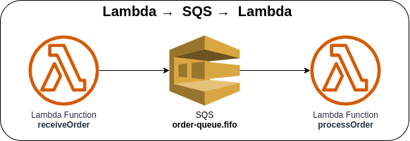

# Lambda → SQS → Lambda



Invoking the first Lambda function via AWS Console or AWS CLI to send the message to an SQS Queue. The second Lambda function will be triggered once it receives the event message from the SQS Queue. The SQS Queue is configured as ".fifo" (First-In-First-Out), which means the messages are ordered based on message group ID and where duplicates can't be tolerated.

### Invoking Lambda function via AWS Console
1. Go to Lambda → Lambda Function → ***Test*** tab
2. Update the Event JSON textarea field (see [sample payload](#sample-payload))
3. Click on the **Test** button in the upper right corner

### Invoking Lambda function via AWS CLI
1. Use the following command and replace the placeholder `lambda_function_name` with the actual Lambda function name

    ```bash
    aws lambda invoke \
    --function-name lambda_function_name \
    --payload '{"referenceId": "SMPLORDR-1234567890", "quantity": 1, "item": [{"id": "SMPLITM-12345", "name": "Sample Item", "price": 1234.50}]}' \
    --cli-binary-format raw-in-base64-out \
    response.json
    ```

#### Sample Payload

* **Payload**
```json
{
  "referenceId": "SMPLORDR-1234567890",
  "quantity": 1,
  "item": [{
    "id": "SMPLITM-12345",
    "name": "Sample Item",
    "price": 1234.50
  }]
}
```

* **CloudWatch Logs**
```json
{
  "log_code": "SQSMessage",
  "log_msg": "Received event from Amazon SQS",
  "log_level": "INFO",
  "log_keys": {
    "eventSource": "aws:sqs",
    "messageId": "9ab59c5d-4650-4e4f-abcd-bff95a6a4996",
    "order": {
      "referenceId": "SMPLORDR-1234567890",
      "status": "RECEIVED",
      "item": [
        {
          "id": "SMPLITM-12345",
          "name": "Sample Item",
          "price": 1234.5
        }
      ],
      "quantity": 1
    }
  },
  "log_timestamp": "2023-04-26 02:33:00"
}
```

### AWS CDK API / Developer Reference
* [AWS Lambda](https://docs.aws.amazon.com/cdk/api/v2/docs/aws-cdk-lib.aws_lambda-readme.html)
* [AWS Lambda Event Sources](https://docs.aws.amazon.com/cdk/api/v2/docs/aws-cdk-lib.aws_lambda_event_sources-readme.html)
* [Amazon Simple Queue Service](https://docs.aws.amazon.com/cdk/api/v2/docs/aws-cdk-lib.aws_sqs-readme.html)

### AWS SDK v2 API / Developer Reference
* [SQS Service Documentation](https://pkg.go.dev/github.com/aws/aws-sdk-go-v2/service/sqs)
* [Getting Started with the AWS SDK for Go V2](https://aws.github.io/aws-sdk-go-v2/docs/getting-started/)

### AWS Documentation Developer Guide
* [SetQueueAttributes](https://docs.aws.amazon.com/AWSSimpleQueueService/latest/APIReference/API_SetQueueAttributes.html)
* [Exactly-once processing](https://docs.aws.amazon.com/AWSSimpleQueueService/latest/SQSDeveloperGuide/FIFO-queues-exactly-once-processing.html)
* [Using Lambda with Amazon SQS](https://docs.aws.amazon.com/lambda/latest/dg/with-sqs.html)
* [Amazon SQS dead-letter queues](https://docs.aws.amazon.com/AWSSimpleQueueService/latest/SQSDeveloperGuide/sqs-dead-letter-queues.html)
* [Amazon SQS visibility timeout](https://docs.aws.amazon.com/AWSSimpleQueueService/latest/SQSDeveloperGuide/sqs-visibility-timeout.html)
* [Tutorial: Using Lambda with Amazon SQS](https://docs.aws.amazon.com/lambda/latest/dg/with-sqs-example.html)
* [Amazon SQS FIFO (First-In-First-Out) queues](https://docs.aws.amazon.com/AWSSimpleQueueService/latest/SQSDeveloperGuide/FIFO-queues.html)

### Useful commands

* `npm run build`   compile typescript to js
* `npm run watch`   watch for changes and compile
* `npm run test`    perform the jest unit tests
* `cdk deploy`      deploy this stack to your default AWS account/region
* `cdk diff`        compare deployed stack with current state
* `cdk synth`       emits the synthesized CloudFormation template

## Deploy

### Using make command
1. Install all the dependencies, bootstrap your project, and synthesized CloudFormation template.
    ```bash
    # Without passing "profile" parameter
    dev@dev:~:aws-cdk-samples/lambda/lambda-sqs$ make init

    # With "profile" parameter
    dev@dev:~:aws-cdk-samples/lambda/lambda-sqs$ make init profile=[profile_name]
    ```

2. Deploy the project.
    ```bash
    # Without passing "profile" parameter
    dev@dev:~:aws-cdk-samples/lambda/lambda-sqs$ make deploy

    # With "profile" parameter
    dev@dev:~:aws-cdk-samples/lambda/lambda-sqs$ make deploy profile=[profile_name]
    ```