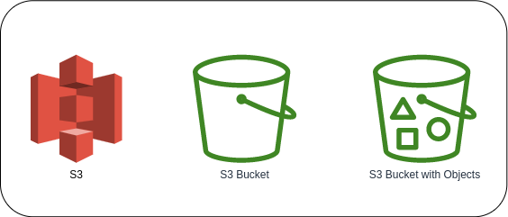

# What is Amazon S3?



**Amazon S3 (Simple Storage Service)** is an object storage that offers scalability, durability, high speed, web-based storage service. It is designed for 99.99.999999999% (11 9's) of durability. S3 is an object storage service that stores data as object within buckets. An *object* is a file and any metadata that describes the file. A *bucket* is a container for objects.

Customers of all sizes and industries can use Amazon S3 to store and protect any amount of data for a range of use cases, such as data lakes, websites, mobile applications, backup and restore, archive, enterprise applications, IoT devices, and big data analytics. Amazon S3 provides management features so that you can optimize, organize, and configure access to your data to meet your specific business, organizational, and compliance requirements.

To store an object in Amazon S3, you create a bucket and then upload the object to the bucket. When the object is in the bucket, you can open it, download it, and move it. When you no longer need an object or a bucket, you can clean up your resources.

### Buckets
A **bucket** is a container for objects stored in Amazon S3. You can store any number of objects in a bucket and can have up to 100 buckets in your account. It is similar to a folder on your local machine but stored in the cloud. Each bucket holds an object with its associated metadata.

### Objects
**Objects** are the fundamental entities stored in Amazon S3. An Amazon S3 object is the actual data you are storing in the bucket. The value of the object which is your data which you have pushed for long or short term storage. Objects consist of object data and metadata. The ***metadata*** is a set of name-value pairs that describe the object. These pairs include some default metadata, such as the date last modified, and standard HTTP metadata, such as `Content-Type`.

### Keys
An ***object key*** (or *key name*) is the unique identifier for an object within a bucket. Every object in a bucket has exactly one key. The combination of a bucket, object key, and optionally, version ID (if S3 versioning is enabled for the bucket) uniquely identify each object.

Example:
```
https://bucket-name.s3.region.amazonaws.com/media/puppy.jpg
```

The `media/puppy.jpg` is the key.

## Use Cases of Amazon S3

### Data Lake
With the increase in data, a scalable solution is required to process it. S3 is a very good candidate to be utilised as a Data Lake. S3 allows you to store all the data in its raw form and services like Amazon Athena helps you to query on it quickly. Amazon Lake Formation is a service by AWS which helps you to create a Data Lake and utilise it for big data processing.

### Backup and restore
S3 is also utilised in storing the backup of databases deployed for the application. Amazon RDS also provides you to create and store a backup directly into an S3 bucket and use them to restore it later directly from S3.

### Archives
S3 is also used as an archive service where a huge amount of data that is not utilised frequently can be saved on the cloud safely and at a low cost. The S3 Glacier storage class allow you to store archival data at a cheap cost.

### Disaster Recovery
With the S3 replication feature, we can store mission-critical data in multiple locations so that we can recover it in case of any disaster or when business continuity is threatened.

### Storage for Applications
Some of the applications require storage options. S3 is an obvious choice for this. With all its features we can create an application that can store user and application data safely and reliably.

## Reference
* [What is Amazon S3?](https://awsmag.com/what-is-amazon-s3/)
* [Amazon Simple Storage Service Documentation](https://docs.aws.amazon.com/s3/index.html)