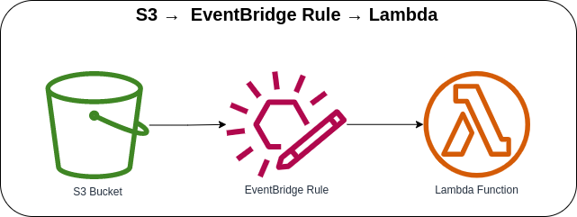

# S3 Bucket → EventBridge Rule → Lambda



Invoking the Lambda Function with EventBridge Rule if there is any event(s) received from the S3 Bucket. Once the Lambda Functions receives an event from the EventBridge Rule, it will print the S3 Event information in the CloudWatch Logs. When naming the *bucket*, it must be unique globally. If you get the *`"Bucket name already exists"`* error, you must use a different bucket name to create the bucket.

#### Sample S3 Event Logs

**Object Created**

```json
{
  "log_code": "S3Events",
  "log_msg": "S3 Events Information",
  "log_level": "INFO",
  "log_keys": {
    "Detail": {
      "version": "0",
      "bucket": {
        "name": "order-data-us-east-1"
      },
      "object": {
        "key": "sample-data.json",
        "size": 187,
        "etag": "8507efd2f590261f7d1613f6f8744445",
        "sequencer": "006426F16D0A15AAFE"
      },
      "request-id": "A4OM5P4G1GIFNXML",
      "requester": "123456789010",
      "source-ip-address": "12.345.678.910",
      "reason": "PutObject"
    },
    "DetailType": "Object Created",
    "ID": "98528b8d-34d3-9013-79b9-a7e273a64681",
    "Source": "aws.s3"
  },
  "log_timestamp": "2023-03-31 14:42:55"
}
```

**Object Deleted**

```json
{
  "log_code": "S3Events",
  "log_msg": "S3 Events Information",
  "log_level": "INFO",
  "log_keys": {
    "Detail": {
      "version": "0",
      "bucket": {
        "name": "order-data-us-east-1"
      },
      "object": {
        "key": "sample-data.json",
        "sequencer": "806426F0F6480F8EE8"
      },
      "request-id": "A4OM5P4G1GIFNXML",
      "requester": "123456789010",
      "source-ip-address": "12.345.678.910",
      "reason": "DeleteObject",
      "deletion-type": "Permanently Deleted"
    },
    "DetailType": "Object Deleted",
    "ID": "98528b8d-5899-8e88-682c-86b485ee489f",
    "Source": "aws.s3"
  },
  "log_timestamp": "2023-03-31 14:40:52"
}
```

### AWS CDK API / Developer Reference
* [Amazon S3](https://docs.aws.amazon.com/cdk/api/v2/docs/aws-cdk-lib.aws_s3-readme.html)
* [AWS Lambda](https://docs.aws.amazon.com/cdk/api/v2/docs/aws-cdk-lib.aws_lambda-readme.html)
* [Amazon EventBridge](https://docs.aws.amazon.com/cdk/api/v2/docs/aws-cdk-lib.aws_events-readme.html)

### AWS SDK v2 API / Developer Reference
* [AWS Lambda Events](https://github.com/aws/aws-lambda-go/blob/main/events/README.md)
* [S3 Service Documentation](https://pkg.go.dev/github.com/aws/aws-sdk-go-v2/service/s3)
* [Getting Started with the AWS SDK for Go V2](https://aws.github.io/aws-sdk-go-v2/docs/getting-started/)

### AWS Documentation Developer Guide
* [Using EventBridge](https://docs.aws.amazon.com/AmazonS3/latest/userguide/EventBridge.html)
* [What Is Amazon EventBridge?](https://docs.aws.amazon.com/eventbridge/latest/userguide/eb-what-is.html)
* [Amazon EventBridge event buses](https://docs.aws.amazon.com/eventbridge/latest/userguide/eb-event-bus.html)
* [Bucket restrictions and limitations](https://docs.aws.amazon.com/AmazonS3/latest/userguide/BucketRestrictions.html)
* [Tutorial: Send a notification when an Amazon S3 object is created](https://docs.aws.amazon.com/eventbridge/latest/userguide/eb-s3-object-created-tutorial.html)
* [How can I resolve the "Bucket name already exists" or "BucketAlreadyExists" error from Amazon S3?](https://repost.aws/knowledge-center/s3-error-bucket-already-exists)

### Useful commands
The `cdk.json` file tells the CDK Toolkit how to execute your app.

* `npm install`     install projects dependencies
* `npm run build`   compile typescript to js
* `npm run watch`   watch for changes and compile
* `npm run test`    perform the jest unit tests
* `cdk deploy`      deploy this stack to your default AWS account/region
* `cdk diff`        compare deployed stack with current state
* `cdk synth`       emits the synthesized CloudFormation template
* `cdk bootstrap`   deployment of AWS CloudFormation template to a specific AWS environment (account and region)
* `cdk destroy`     destroy this stack from your default AWS account/region

## Deploy

### Using `make` command
1. Install all the dependencies, bootstrap your project, and synthesized CloudFormation template.
  ```bash
  # Without passing "profile" parameter
  dev@dev:~:aws-cdk-samples/s3/s3-eventbridge-lambda$ make init

  # With "profile" parameter
  dev@dev:~:aws-cdk-samples/s3/s3-eventbridge-lambda$ make init profile=[profile_name]
  ```

2. Deploy the project.

  ```bash
  # Without passing "profile" parameter
  dev@dev:~:aws-cdk-samples/s3/s3-eventbridge-lambda$ make deploy

  # With "profile" parameter
  dev@dev:~:aws-cdk-samples/s3/s3-eventbridge-lambda$ make deploy profile=[profile_name]
  ```