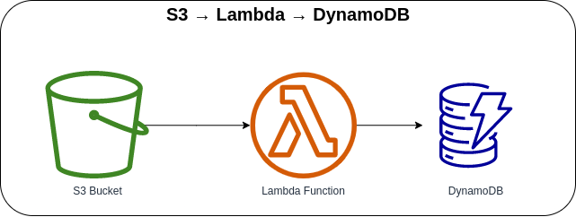

# S3 Bucket → Lambda → DynamoDB



Invoking the Lambda Function with S3 Bucket Object Creation, processing the information fetched on the S3 Bucket, and saving the processed data on DynamoDB Table. After processing the raw data, it will be deleted from the S3 bucket. When naming the *bucket*, it must be unique globally. If you get the *`"Bucket name already exists"`* error, you must use a different bucket name to create the bucket.

**NOTE**: It will only be triggered if the object that was uploaded is a JSON file (`.json`).

#### Sample JSON Object
```json
{
  "name": "Garmin Venu 2 Plus",
  "description": "All-round watch for both exercise and health",
  "price": 307.40,
  "category": {
    "id": "1",
    "name": "Jewelry & watches"
  }
}
```

### AWS CDK API / Developer Reference
* [Amazon S3](https://docs.aws.amazon.com/cdk/api/v2/docs/aws-cdk-lib.aws_s3-readme.html)
* [AWS Lambda](https://docs.aws.amazon.com/cdk/api/v2/docs/aws-cdk-lib.aws_lambda-readme.html)
* [AWS DynamoDB](https://docs.aws.amazon.com/cdk/api/v2/docs/aws-cdk-lib.aws_dynamodb-readme.html)

### AWS SDK v2 API / Developer Reference
* [AWS Lambda Events](https://github.com/aws/aws-lambda-go/blob/main/events/README.md)
* [S3 Service Documentation](https://pkg.go.dev/github.com/aws/aws-sdk-go-v2/service/s3)
* [Getting Started with the AWS SDK for Go V2](https://aws.github.io/aws-sdk-go-v2/docs/getting-started/)

### AWS Documentation Developer Guide
* [Core components of Amazon DynamoDB](https://docs.aws.amazon.com/amazondynamodb/latest/developerguide/HowItWorks.CoreComponents.html)
* [Bucket restrictions and limitations](https://docs.aws.amazon.com/AmazonS3/latest/userguide/BucketRestrictions.html)
* [Best practices for designing and using partition keys effectively](https://docs.aws.amazon.com/amazondynamodb/latest/developerguide/bp-partition-key-design.html)
* [How can I resolve the "Bucket name already exists" or "BucketAlreadyExists" error from Amazon S3?](https://repost.aws/knowledge-center/s3-error-bucket-already-exists)

### Useful commands
The `cdk.json` file tells the CDK Toolkit how to execute your app.

* `npm install`     install projects dependencies
* `npm run build`   compile typescript to js
* `npm run watch`   watch for changes and compile
* `npm run test`    perform the jest unit tests
* `cdk deploy`      deploy this stack to your default AWS account/region
* `cdk diff`        compare deployed stack with current state
* `cdk synth`       emits the synthesized CloudFormation template
* `cdk bootstrap`   deployment of AWS CloudFormation template to a specific AWS environment (account and region)
* `cdk destroy`     destroy this stack from your default AWS account/region

## Deploy

### Using `make` command
1. Install all the dependencies, bootstrap your project, and synthesized CloudFormation template.
  ```bash
  # Without passing "profile" parameter
  dev@dev:~:aws-cdk-samples/s3/s3-lambda-dynamodb$ make init

  # With "profile" parameter
  dev@dev:~:aws-cdk-samples/s3/s3-lambda-dynamodb$ make init profile=[profile_name]
  ```

2. Deploy the project.

  ```bash
  # Without passing "profile" parameter
  dev@dev:~:aws-cdk-samples/s3/s3-lambda-dynamodb$ make deploy

  # With "profile" parameter
  dev@dev:~:aws-cdk-samples/s3/s3-lambda-dynamodb$ make deploy profile=[profile_name]
  ```