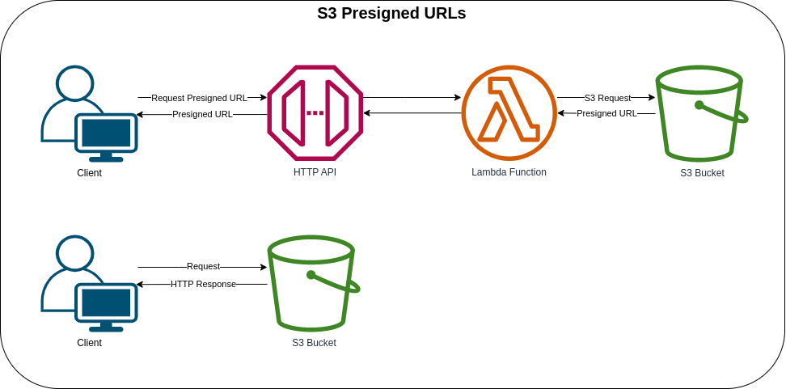

# S3 Presigned URLs



This is a two-step process for your front-end application. In the first step of the process, the API Gateway endpoint invokes the Lambda Function to make a signed URL request. Once the frontend application receives the API Gateway endpoint response, it will then send a request to the signed URL. Uploading directly to an S3 bucket, you must first request a signed URL from the Amazon S3 service. The request contains the ***key*** of the uploaded object, the ***content type***, and ***action*** that is equal to *upload*. You can then upload directly using the signed URL. To make the S3 object downloadable, you must change the response **Content-Disposition** header value to *attachment*.

You can test the following by using the provided HTML file that is in the [web/static](web/static/index.html) directory. After deploying the stack, remember to update the API Gateway Endpoint on the said HTML file.

**NOTE**:
* You can use either the `$default` or `prod` stage for the API Gateway endpoint.
* The S3 Bucket and its objects are configured to be deleted once the stack is destroyed/deleted.
* When uploading objects to S3 from a web application, the S3 must be configured for CORS (Cross-Origin Resource Sharing). The frontend application uses binary data to upload directly to the signed URL.

```javascript
let array = [],
    binary = atob(content.split(',')[1]);

for (var i = 0; i < binary.length; i++)
{
  array.push(binary.charCodeAt(i));
}

let blob = new Blob([ new Uint8Array(array) ], { type: type });

fetch(response.url, {
  method: 'PUT',
  body: blob
}).catch(error => {
  console.error("Upload error: ", error);
});
```

#### CORS Configuration
* **Allowed Headers**: '*'
* **Allowed Origins**: '*'
* **Allowed Methods**: GET, PUT, HEAD

The preceding policy allows all headers and origins - it is recommended that you use a more restrictive policy for production workloads.

### AWS CDK API / Developer Reference
* [Amazon S3](https://docs.aws.amazon.com/cdk/api/v2/docs/aws-cdk-lib.aws_s3-readme.html)
* [AWS Lambda](https://docs.aws.amazon.com/cdk/api/v2/docs/aws-cdk-lib.aws_lambda-readme.html)
* [Amazon API Gateway v2](https://docs.aws.amazon.com/cdk/api/v2/docs/aws-apigatewayv2-alpha-readme.html)
* [Amazon API Gateway v2 Integrations](https://docs.aws.amazon.com/cdk/api/v2/docs/aws-apigatewayv2-integrations-alpha-readme.html)
* [HTTP API Example in AWS CDK [API Gateway V2]](https://bobbyhadz.com/blog/aws-cdk-http-api-apigateway-v2-example)

### AWS SDK v2 API / Developer Reference
* [AWS Lambda Events](https://github.com/aws/aws-lambda-go/blob/main/events/README.md)
* [S3 Service Documentation](https://pkg.go.dev/github.com/aws/aws-sdk-go-v2/service/s3)
* [Getting Started with the AWS SDK for Go V2](https://aws.github.io/aws-sdk-go-v2/docs/getting-started/)

### AWS Documentation Developer Guide
* [CORS configuration](https://docs.aws.amazon.com/AmazonS3/latest/userguide/ManageCorsUsing.html)
* [Downloading an object](https://docs.aws.amazon.com/AmazonS3/latest/userguide/download-objects.html)
* [Bucket restrictions and limitations](https://docs.aws.amazon.com/AmazonS3/latest/userguide/BucketRestrictions.html)
* [Using cross-origin resource sharing (CORS)](https://docs.aws.amazon.com/AmazonS3/latest/userguide/cors.html)
* [Uploading to Amazon S3 directly from a web or mobile application](https://aws.amazon.com/blogs/compute/uploading-to-amazon-s3-directly-from-a-web-or-mobile-application/)
* [How can I resolve the "Bucket name already exists" or "BucketAlreadyExists" error from Amazon S3?](https://repost.aws/knowledge-center/s3-error-bucket-already-exists)

### Useful commands
The `cdk.json` file tells the CDK Toolkit how to execute your app.

* `npm install`     install projects dependencies
* `npm run build`   compile typescript to js
* `npm run watch`   watch for changes and compile
* `npm run test`    perform the jest unit tests
* `cdk deploy`      deploy this stack to your default AWS account/region
* `cdk diff`        compare deployed stack with current state
* `cdk synth`       emits the synthesized CloudFormation template
* `cdk bootstrap`   deployment of AWS CloudFormation template to a specific AWS environment (account and region)
* `cdk destroy`     destroy this stack from your default AWS account/region

## Deploy

### Using `make` command
1. Install all the dependencies, bootstrap your project, and synthesized CloudFormation template.
  ```bash
  # Without passing "profile" parameter
  dev@dev:~:aws-cdk-samples/api-gateway/s3-presigned-urls$ make init

  # With "profile" parameter
  dev@dev:~:aws-cdk-samples/api-gateway/s3-presigned-urls$ make init profile=[profile_name]
  ```

2. Deploy the project.

  ```bash
  # Without passing "profile" parameter
  dev@dev:~:aws-cdk-samples/api-gateway/s3-presigned-urls$ make deploy

  # With "profile" parameter
  dev@dev:~:aws-cdk-samples/api-gateway/s3-presigned-urls$ make deploy profile=[profile_name]
  ```