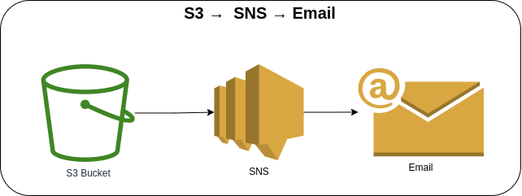
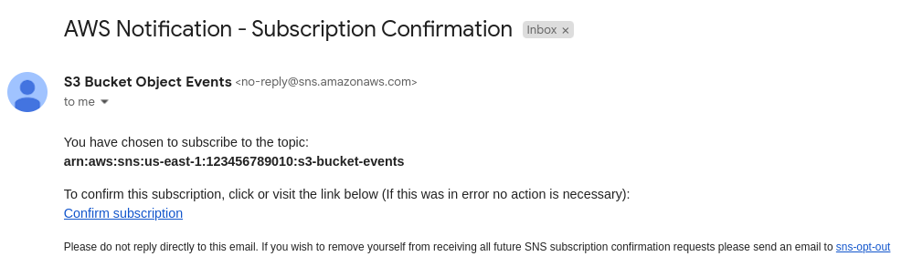
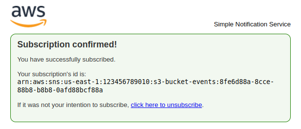
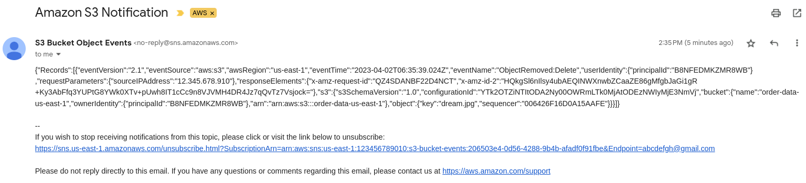

# S3 Bucket → SNS → Email



For every object removal from the S3 Bucket, the SNS Topic Subscription will send an email notification. Once the stack is deployed it will send an email confirmation to subscribe to the SNS topic. After subscribing to the SNS topic, you will receive an email notification for every object removal from the S3 Bucket. When naming the *bucket*, it must be unique globally. If you get the *`"Bucket name already exists"`* error, you must use a different bucket name to create the bucket.

**NOTE**: Update the **`EmailSubscription`** endpoint on the [s3-sns-stack.ts](lib/stacks/s3-sns-stack.ts) file.

#### SNS Subscription Confirmation


#### SNS Subscription Confirmed


#### SNS Email Notification


### AWS CDK API / Developer Reference
* [Amazon S3](https://docs.aws.amazon.com/cdk/api/v2/docs/aws-cdk-lib.aws_s3-readme.html)
* [Amazon Simple Notification](https://docs.aws.amazon.com/cdk/api/v2/docs/aws-cdk-lib.aws_sns-readme.html)
* [Amazon Simple Notification Subscriptions](https://docs.aws.amazon.com/cdk/api/v2/docs/aws-cdk-lib.aws_sns_subscriptions-readme.html)

### AWS Documentation Developer Guide
* [Amazon SNS FAQs](https://aws.amazon.com/sns/faqs/)
* [Amazon S3 Event Notifications](https://docs.aws.amazon.com/AmazonS3/latest/userguide/NotificationHowTo.html)
* [Bucket restrictions and limitations](https://docs.aws.amazon.com/AmazonS3/latest/userguide/BucketRestrictions.html)
* [Event notification types and destinations](https://docs.aws.amazon.com/AmazonS3/latest/userguide/notification-how-to-event-types-and-destinations.html)
* [Supported event types for SQS, SNS, and Lambda](https://docs.aws.amazon.com/AmazonS3/latest/userguide/notification-how-to-event-types-and-destinations.html#supported-notification-event-types)
* [Tutorial: Send a notification when an Amazon S3 object is created](https://docs.aws.amazon.com/eventbridge/latest/userguide/eb-s3-object-created-tutorial.html)
* [Walkthrough: Configuring a bucket for notifications (SNS topic or SQS queue)](https://docs.aws.amazon.com/AmazonS3/latest/userguide/ways-to-add-notification-config-to-bucket.html)
* [How can I resolve the "Bucket name already exists" or "BucketAlreadyExists" error from Amazon S3?](https://repost.aws/knowledge-center/s3-error-bucket-already-exists)

### Useful commands
The `cdk.json` file tells the CDK Toolkit how to execute your app.

* `npm install`     install projects dependencies
* `npm run build`   compile typescript to js
* `npm run watch`   watch for changes and compile
* `npm run test`    perform the jest unit tests
* `cdk deploy`      deploy this stack to your default AWS account/region
* `cdk diff`        compare deployed stack with current state
* `cdk synth`       emits the synthesized CloudFormation template
* `cdk bootstrap`   deployment of AWS CloudFormation template to a specific AWS environment (account and region)
* `cdk destroy`     destroy this stack from your default AWS account/region

## Deploy

### Using `make` command
1. Install all the dependencies, bootstrap your project, and synthesized CloudFormation template.
  ```bash
  # Without passing "profile" parameter
  dev@dev:~:aws-cdk-samples/s3/s3-lambda-dynamodb$ make init

  # With "profile" parameter
  dev@dev:~:aws-cdk-samples/s3/s3-lambda-dynamodb$ make init profile=[profile_name]
  ```

2. Deploy the project.

  ```bash
  # Without passing "profile" parameter
  dev@dev:~:aws-cdk-samples/s3/s3-lambda-dynamodb$ make deploy

  # With "profile" parameter
  dev@dev:~:aws-cdk-samples/s3/s3-lambda-dynamodb$ make deploy profile=[profile_name]
  ```