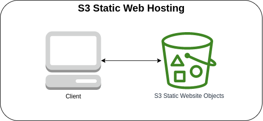

# S3 Static Website hosting



The Amazon S3 offers a functionality that allows you to host a static website. The website should be simple since server-side scripts like PHP, are not supported. After deploying the stack, you can test the website endpoint by going to the **Buckets** -> **Properties** -> **Static website hosting** that is at the bottom of the page.

### AWS CDK API / Developer Reference
* [Amazon S3](https://docs.aws.amazon.com/cdk/api/v2/docs/aws-cdk-lib.aws_s3-readme.html)
* [AWS S3 Deployment](https://docs.aws.amazon.com/cdk/api/v2/docs/aws-cdk-lib.aws_s3_deployment-readme.html)

### AWS Documentation Developer Guide
* [Hosting a static website using Amazon S3](https://docs.aws.amazon.com/AmazonS3/latest/userguide/WebsiteHosting.html)
* [Tutorial: Configuring a static website on Amazon S3](https://docs.aws.amazon.com/AmazonS3/latest/userguide/HostingWebsiteOnS3Setup.html)

### Useful commands
The `cdk.json` file tells the CDK Toolkit how to execute your app.

* `npm install`     install projects dependencies
* `npm run build`   compile typescript to js
* `npm run watch`   watch for changes and compile
* `npm run test`    perform the jest unit tests
* `cdk deploy`      deploy this stack to your default AWS account/region
* `cdk diff`        compare deployed stack with current state
* `cdk synth`       emits the synthesized CloudFormation template
* `cdk bootstrap`   deployment of AWS CloudFormation template to a specific AWS environment (account and region)
* `cdk destroy`     destroy this stack from your default AWS account/region

## Deploy

### Using `make` command
1. Install all the dependencies, bootstrap your project, and synthesized CloudFormation template.
    ```bash
    # Without passing "profile" parameter
    dev@dev:~:aws-cdk-samples/s3/s3-website$ make init

    # With "profile" parameter
    dev@dev:~:aws-cdk-samples/s3/s3-website$ make init profile=[profile_name]
    ```

2. Deploy the project.
    ```bash
    # Without passing "profile" parameter
    dev@dev:~:aws-cdk-samples/s3/s3-website$ make deploy

    # With "profile" parameter
    dev@dev:~:aws-cdk-samples/s3/s3-website$ make deploy profile=[profile_name]
    ```