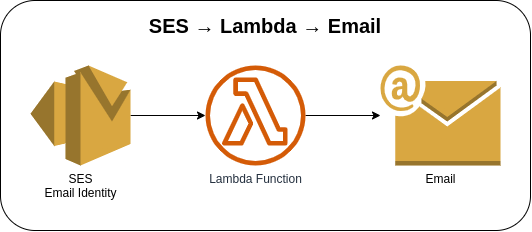
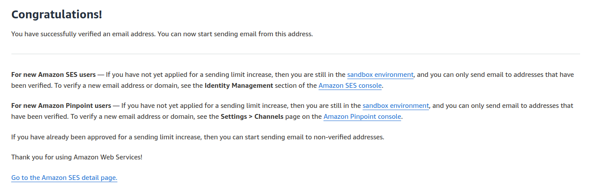

# SES Sending Email



Invoking the Lambda function via AWS Console or AWS CLI to create a request to the SES to send an e-mail using the configured e-mail identity on AWS SES. The e-mail identity set must be verified beforehand, and remember that the e-mail address is case-sensitive. The Lambda function must have permission or is authorized to perform **`ses:SendEmail`** on the SES resource identity.

Check the inbox of the e-mail address used to create your identity and click the link to complete the verification process for the e-mail address.




### Invoking Lambda function via AWS Console
1. Go to Lambda → Lambda Function → **Test** tab
2. Update the Event JSON textarea field (see [sample payload](#sample-payload))
3. Click on the **Test** button in the upper right corner

### Invoking Lambda function via AWS CLI
1. Use the following command and replace the placeholder `lambda_function_name` with the actual Lambda function name
    ```bash
    aws lambda invoke \
    --function-name lambda_function_name \
    --payload '{"subject": "COD #210327LL6J2NE7", "recipients": [ "j.doe@email.com" ], "body": "Hello John Doe,\nYour Cash On Delivery (COD) payment request for order #210327LL6J2NE7 has been approved. We have notified the seller to start shipping your item(s).\n\n\tORDER DETAILS\n\t\tOrder ID:     #210327LL6J2NE7\n\t\tOrder Date:   03/27/21 01:16:27\n\t\tSeller:       ABC Company Inc.\n\nKindly wait for your shipment and have cash ready to pay for your products upon delivery. Once you receive and accept the product(s), kindly confirm this with us in ABC App."}' \
    --cli-binary-format raw-in-base64-out \
    response.json
    ```

### Sample Payload
```json
{
  "subject": "COD #210327LL6J2NE7",
  "recipients": [ "j.doe@email.com" ],
  "body": "Hello John Doe,\nYour Cash On Delivery (COD) payment request for order #210327LL6J2NE7 has been approved. We have notified the seller to start shipping your item(s).\n\n\tORDER DETAILS\n\t\tOrder ID:     #210327LL6J2NE7\n\t\tOrder Date:   03/27/21 01:16:27\n\t\tSeller:       ABC Company Inc.\n\nKindly wait for your shipment and have cash ready to pay for your products upon delivery. Once you receive and accept the product(s), kindly confirm this with us in ABC App."
}
```

### AWS CDK API / Developer Reference
* [AWS Lambda](https://docs.aws.amazon.com/cdk/api/v2/docs/aws-cdk-lib.aws_lambda-readme.html)
* [Amazon Simple Email Service](https://docs.aws.amazon.com/cdk/api/v2/docs/aws-cdk-lib.aws_ses-readme.html)

### AWS SDK v2 API / Developer Reference
* [SES v2 Documentation](https://pkg.go.dev/github.com/aws/aws-sdk-go-v2/service/sesv2)
* [Getting Started with the AWS SDK for Go V2](https://aws.github.io/aws-sdk-go-v2/docs/getting-started/)

### AWS Documentation Developer Guide

### Useful commands
The `cdk.json` file tells the CDK Toolkit how to execute your app.

* `npm install`     install projects dependencies
* `npm run build`   compile typescript to js
* `npm run watch`   watch for changes and compile
* `npm run test`    perform the jest unit tests
* `cdk deploy`      deploy this stack to your default AWS account/region
* `cdk diff`        compare deployed stack with current state
* `cdk synth`       emits the synthesized CloudFormation template
* `cdk bootstrap`   deployment of AWS CloudFormation template to a specific AWS environment (account and region)
* `cdk destroy`     destroy this stack from your default AWS account/region

## Deploy

### Using `make` command
1. Install all the dependencies, bootstrap your project, and synthesized CloudFormation template.
    ```bash
    # Without passing "profile" parameter
    dev@dev:~:aws-cdk-samples/ses/ses-send-email$ make init

    # With "profile" parameter
    dev@dev:~:aws-cdk-samples/ses/ses-send-email$ make init profile=[profile_name]
    ```

2. Deploy the project.
    ```bash
    # Without passing "profile" parameter
    dev@dev:~:aws-cdk-samples/ses/ses-send-email$ make deploy

    # With "profile" parameter
    dev@dev:~:aws-cdk-samples/ses/ses-send-email$ make deploy profile=[profile_name]
    ```