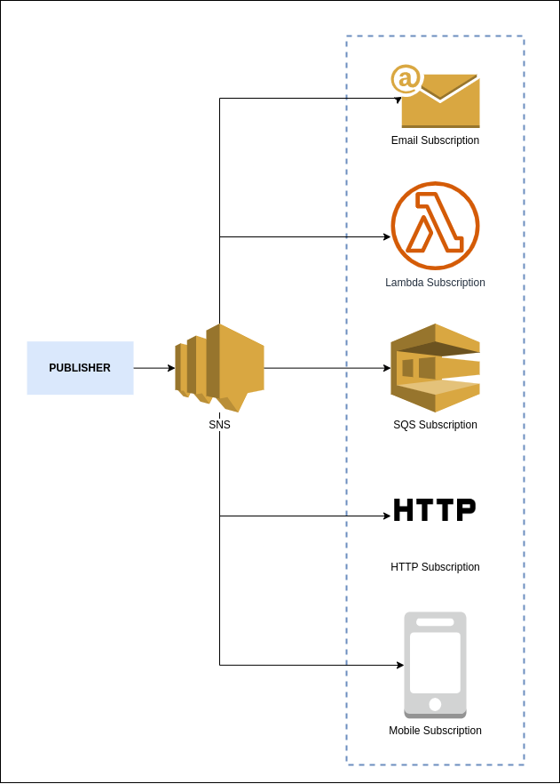

# What is Amazon SNS?

**Amazon Simple Notification Service (Amazon SNS)** is a managed service that provides message delivery from publishers to subscribers (also known as *producers* and *consumers*). **Publishers** communicate asynchronously with subscribers by sending messages to a *topic*, which is a logical access point and communication channel. Clients can subscribe to the SNS topic and receive published messages using a supported endpoint type.

Amazon SNS provides developers with the highly scalable, cost-effective, and flexible capability to publish messages from an application and sens them to other applications. It follows the publis-subscribe (pub/sub) messaging paradigm with notification being delivered to the client using a push mechanism that eliminates the need to periodically check or poll for new information and updates.

To prevent the message from being lost, all messages published to Amazon SNS are stored redundantly across multiple Availability Zones. SNS can also send the messages to devices by sending push notifications to Apple, Google, Fire OS, and Windows devices, as well as Android devices in China with Baidu Cloud Push. It allows you to group multiple recipients using topics where the topic is a logical access point that sends the identical copies of the same message to the subscribe recipients.

### Amazon SNS Building Blocks

#### Publisher
* The entity that triggers the sending of a message (e.g. CloudWatch Alarm, any application or S3 events).
* Publishers are also known as *producers* that produce and send message to SNS which is a logical access point.

#### Topic
* Object to which you publish your message.
* Subscriber subscribe to the topic to receive the message.
* By default, SNS offers 100, 000 topics per account (soft limit).
* With the exception of SMS messages, Amazon SNS messages can contain up to 256 KB of text data, including XML, JSON and unformatted text.

#### Subscriber
* An *endpoint* to a message is sent. Message are simultaneously pushed to the subscriber.
* Subscribers such as Amazon SQS, AWS Lambda, Amazon Kinesis Data Firehose, HTTP/s endpoints, e-mail, mobile push notifications, and mobile text messages (SMS) receive the message or notification from the SNS over one of the supported.
* Subscriber subscribe to the topic to receive the message.
* By default, SNS offers 10 million subscriptions per topic (soft limit).

## Amazon SNS Benefits

### Instantaneous delivery
SNS is based on *push-based delivery*. This is the key difference between SNS and SQS. SNS is pushed once you publish the message in a topic and the message is delivered to multiple subscribers.

### Flexible
SNS supports multiple endpoint types. Multiple endpoint types can receive the message over multiple transport protocols such as e-mail, SMS, Lambda, Amazon SQS, HTTP, etc.

### Inexpensive
SNS service is quite inexpensive as it is based on pay-as-you-go model, i.e., you need to pay only when you are using the resources with no up-front costs.

### Ease of use
SNS service is very simple to use as Web-based AWS Management Console offers the simplicity of the point-and-click interface.

### Simple Architecture
SNS is used to simplify the message architecture by offloading the message filtering logic from subscribers and message routing logic from the publishers. Instead of receiving all the messages from the topic, SNS sends the message to subscriber-only of their interest.

## Reference
* [What is Amazon SNS?](https://docs.aws.amazon.com/sns/latest/dg/welcome.html)
* [AWS — Amazon SNS Overview](https://medium.com/awesome-cloud/aws-introduction-to-amazon-sns-simple-notification-service-b7cb18c2cb9f)