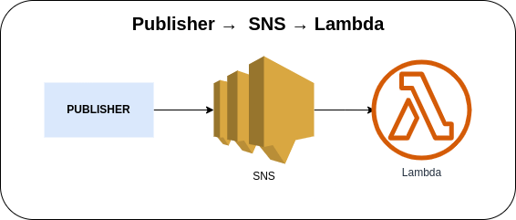

# SNS Lambda Subscription



Publishing a message to the Amazon Simple Notification Service via AWS Console or AWS CLI to trigger the AWS Lambda Function.

### Invoking SNS function via AWS Console
1. Go to Amazon SNS → Topics → *Your SNS Topic* → **Publish message**
2. Enter the following information

    a. Subject (optional)

    b. Message body (see [sample payload](#sample-payload))

3. Click on the **Publish message** in the bottom right corner

### Invoking SNS via AWS CLI
1. Use the following command and replace the placeholder `sns_topic_arn` with the actual SNS Topic ARN

    ```bash
    aws sns publish \
    --topic-arn sns_topic_arn \
    --message file://sns-sample-message.txt \
    --subject "Cash on Delivery (COD) #210327LL6J2NE7"
    ```

    It will publish the specified message to the specified SNS Topic. The message comes from a text file, which enables you to include line breaks.

### Sample Payload
```
Hello John,
  
We regret to inform you that your Cash on Delivery (COD) payment request for order #210327LL6J2NE7 has been declined. We have notified the seller to cancel the shipping of your item(s).
```

### Sample CloudWatch Logs of SNS Record
```json
{
    "log_code": "SNSEvent",
    "log_msg": "Events from the SNS Topic",
    "log_level": "INFO",
    "log_keys": {
        "record": {
            "EventVersion": "1.0",
            "EventSubscriptionArn": "arn:aws:sns:us-east-1:123456789101:sns-topic:1ab234c5-def6-7891-01a1-1213b141c5d1",
            "EventSource": "aws:sns",
            "Sns": {
                "Signature": "xxxxxxxxxxxxxxxxxxxxxxxxxxxxxxxxxxxxxxxxxxxxxxx",
                "MessageId": "1a2b34cd-5678-910e-1fab-112c13d14e15",
                "Type": "Notification",
                "TopicArn": "arn:aws:sns:us-east-1:123456789101:sns-topic",
                "MessageAttributes": {},
                "SignatureVersion": "1",
                "Timestamp": "2023-05-23T03:17:46.086Z",
                "SigningCertUrl": "https://sns.us-east-1.amazonaws.com/SimpleNotificationService-01a234b56c7891d0ef111a2131b41bc5.pem",
                "Message": "Hello John,\n  \nWe regret to inform you that your Cash on Delivery (COD) payment request for order #210327LL6J2NE7 has been declined. We have notified the seller to cancel the shipping of your item(s).",
                "UnsubscribeUrl": "https://sns.us-east-1.amazonaws.com/?Action=Unsubscribe&SubscriptionArn=arn:aws:sns:us-east-1:123456789101:sns-topic:1ab234c5-def6-7891-01a1-1213b141c5d1",
                "Subject": "Cash on Delivery (COD) #210327LL6J2NE7"
            }
        }
    },
    "log_timestamp": "2023-05-23 03:17:46"
}
```

### AWS CDK API / Developer Reference
* [Amazon Simple Notification Service](https://docs.aws.amazon.com/cdk/api/v2/docs/aws-cdk-lib.aws_sns-readme.html)
* [Amazon Simple Notification Service Subscriptions](https://docs.aws.amazon.com/cdk/api/v2/docs/aws-cdk-lib.aws_sns_subscriptions-readme.html)

### AWS SDK v2 API / Developer Reference
* [AWS Lambda Events](https://github.com/aws/aws-lambda-go/blob/main/events/README.md)
* [Getting Started with the AWS SDK for Go V2](https://aws.github.io/aws-sdk-go-v2/docs/getting-started/)

### AWS Documentation Developer Guide
* [Publish](https://docs.aws.amazon.com/sns/latest/api/API_Publish.html)
* [Subscribe](https://docs.aws.amazon.com/sns/latest/api/API_Subscribe.html)
* [Amazon SNS FAQs](https://aws.amazon.com/sns/faqs/)
* [Email notifications](https://docs.aws.amazon.com/sns/latest/dg/sns-email-notifications.html)
* [Amazon Simple Notification Service endpoints and quotas](https://docs.aws.amazon.com/general/latest/gr/sns.html)
* [Tutorial: Using AWS Lambda with Amazon Simple Notification Service](https://docs.aws.amazon.com/lambda/latest/dg/with-sns-example.html)

### Useful commands
The `cdk.json` file tells the CDK Toolkit how to execute your app.

* `npm install`     install projects dependencies
* `npm run build`   compile typescript to js
* `npm run watch`   watch for changes and compile
* `npm run test`    perform the jest unit tests
* `cdk deploy`      deploy this stack to your default AWS account/region
* `cdk diff`        compare deployed stack with current state
* `cdk synth`       emits the synthesized CloudFormation template
* `cdk bootstrap`   deployment of AWS CloudFormation template to a specific AWS environment (account and region)
* `cdk destroy`     destroy this stack from your default AWS account/region

## Deploy

### Using `make` command
1. Install all the dependencies, bootstrap your project, and synthesized CloudFormation template.
    ```bash
    # Without passing "profile" parameter
    dev@dev:~:aws-cdk-samples/sns/sns-lambda-subscription$ make init

    # With "profile" parameter
    dev@dev:~:aws-cdk-samples/sns/sns-lambda-subscription$ make init profile=[profile_name]
    ```

2. Deploy the project.
    ```bash
    # Without passing "profile" parameter
    dev@dev:~:aws-cdk-samples/sns/sns-lambda-subscription$ make deploy

    # With "profile" parameter
    dev@dev:~:aws-cdk-samples/sns/sns-lambda-subscription$ make deploy profile=[profile_name]
    ```