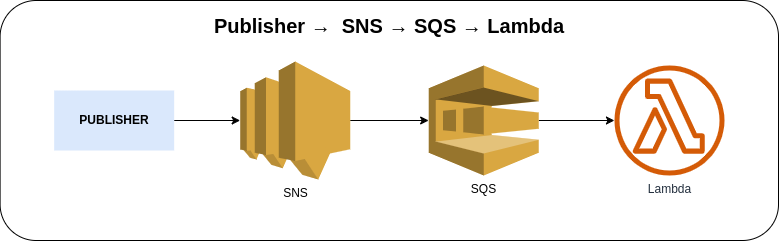

# SNS SQS Subscription



Publishing a message to the Amazon Simple Notification Service via AWS Console or AWS CLI to send a message to an SQS Queue as the subscription target and the Lambda Function will be triggered once it receives the event message from the SQS Queue.

### Invoking SNS function via AWS Console
1. Go to Amazon SNS → Topics → *Your SNS Topic* → **Publish message**
2. Enter the following information

    a. Subject (optional)

    b. Message body (see [sample payload](#sample-payload))

3. Click on the **Publish message** in the bottom right corner

### Invoking SNS via AWS CLI
1. Use the following command and replace the placeholder `sns_topic_arn` with the actual SNS Topic ARN

    ```bash
    aws sns publish \
    --topic-arn sns_topic_arn \
    --message file://sns-sample-message.json \
    --subject "Cash on Delivery (COD) #210327LL6J2NE7"
    ```

    The message comes from a JSON file and it will publish the specified message to the specified SNS Topic.

### Sample Payload
```json
{
  "referenceId": "210327LL6J2NE7",
  "quantity": 1,
  "item": [{
    "id": "SMPLITM-12345",
    "name": "Sample Item",
    "price": 1234.50
  }]
}
```

### Sample CloudWatch Logs of SNS Event -> SQS Event Record
```json
{
    "log_code": "SQSEvent",
    "log_msg": "Events from the SNS Topic -> SQS Queue",
    "log_level": "INFO",
    "log_keys": {
        "record": {
            "messageId": "a1234b5c-d6e7-8fa9-1b10-c1112def13ab",
            "receiptHandle": "xxxxxxxxxxxxxxxxxxxxxxxxxxxxxxxxxxxxxxxxxx",
            "body": "{\n  \"Type\" : \"Notification\",\n  \"MessageId\" : \"12a34567-bc89-10de-1f11-c2a13b14151\",\n  \"TopicArn\" : \"arn:aws:sns:us-east-1:123456789101:sns-topic\",\n  \"Subject\" : \"Cash on Delivery (COD) #210327LL6J2NE7\",\n  \"Message\" : \"{\\n  \\\"referenceId\\\": \\\"SMPLORDR-1234567890\\\",\\n  \\\"quantity\\\": 1,\\n  \\\"item\\\": [\\n    {\\n      \\\"id\\\": \\\"SMPLITM-12345\\\",\\n      \\\"name\\\": \\\"Sample Item\\\",\\n      \\\"price\\\": 1234.50\\n    }\\n  ]\\n}\",\n  \"Timestamp\" : \"2023-05-23T09:05:09.617Z\",\n  \"SignatureVersion\" : \"1\",\n  \"Signature\" : \"xxxxxxxxxxxxxxxxxxxxxxxxxxxxxxxxxxxxxxxxxx\",\n  \"SigningCertURL\" : \"https://sns.us-east-1.amazonaws.com/SimpleNotificationService-12a34567bc8910de1f11c2a13b141516.pem\",\n  \"UnsubscribeURL\" : \"https://sns.us-east-1.amazonaws.com/?Action=Unsubscribe&SubscriptionArn=arn:aws:sns:us-east-1:123456789101:sns-topic:12a34567-bc89-10de-1f11-c2a13b14151\"\n}",
            "md5OfBody": "12a34567bc8910de1f11c2a13b14151",
            "md5OfMessageAttributes": "",
            "attributes": {
                "ApproximateFirstReceiveTimestamp": "1684832709676",
                "ApproximateReceiveCount": "1",
                "SenderId": "XXXXXXXXXXXXXXXXXXXXX",
                "SentTimestamp": "1684832709668"
            },
            "messageAttributes": {},
            "eventSourceARN": "arn:aws:sqs:us-east-1:123456789101:order-queue",
            "eventSource": "aws:sqs",
            "awsRegion": "us-east-1"
        }
    },
    "log_timestamp": "2023-05-23 09:05:10"
}
```

### AWS CDK API / Developer Reference
* [AWS Lambda](https://docs.aws.amazon.com/cdk/api/v2/docs/aws-cdk-lib.aws_lambda-readme.html)
* [AWS Lambda Event Sources](https://docs.aws.amazon.com/cdk/api/v2/docs/aws-cdk-lib.aws_lambda_event_sources-readme.html)
* [Amazon Simple Queue Service](https://docs.aws.amazon.com/cdk/api/v2/docs/aws-cdk-lib.aws_sqs-readme.html)
* [Amazon Simple Notification Service](https://docs.aws.amazon.com/cdk/api/v2/docs/aws-cdk-lib.aws_sns-readme.html)
* [Amazon Simple Notification Service Subscriptions](https://docs.aws.amazon.com/cdk/api/v2/docs/aws-cdk-lib.aws_sns_subscriptions-readme.html)

### AWS SDK v2 API / Developer Reference
* [AWS Lambda Events](https://github.com/aws/aws-lambda-go/blob/main/events/README.md)
* [Getting Started with the AWS SDK for Go V2](https://aws.github.io/aws-sdk-go-v2/docs/getting-started/)

### AWS Documentation Developer Guide
* [Publish](https://docs.aws.amazon.com/sns/latest/api/API_Publish.html)
* [Subscribe](https://docs.aws.amazon.com/sns/latest/api/API_Subscribe.html)
* [Amazon SNS FAQs](https://aws.amazon.com/sns/faqs/)
* [Email notifications](https://docs.aws.amazon.com/sns/latest/dg/sns-email-notifications.html)
* [Amazon Simple Notification Service endpoints and quotas](https://docs.aws.amazon.com/general/latest/gr/sns.html)
* [Tutorial: Using AWS Lambda with Amazon Simple Notification Service](https://docs.aws.amazon.com/lambda/latest/dg/with-sns-example.html)

### Useful commands
The `cdk.json` file tells the CDK Toolkit how to execute your app.

* `npm install`     install projects dependencies
* `npm run build`   compile typescript to js
* `npm run watch`   watch for changes and compile
* `npm run test`    perform the jest unit tests
* `cdk deploy`      deploy this stack to your default AWS account/region
* `cdk diff`        compare deployed stack with current state
* `cdk synth`       emits the synthesized CloudFormation template
* `cdk bootstrap`   deployment of AWS CloudFormation template to a specific AWS environment (account and region)
* `cdk destroy`     destroy this stack from your default AWS account/region

## Deploy

### Using `make` command
1. Install all the dependencies, bootstrap your project, and synthesized CloudFormation template.
    ```bash
    # Without passing "profile" parameter
    dev@dev:~:aws-cdk-samples/sns/sns-sqs-subscription$ make init

    # With "profile" parameter
    dev@dev:~:aws-cdk-samples/sns/sns-sqs-subscription$ make init profile=[profile_name]
    ```

2. Deploy the project.
    ```bash
    # Without passing "profile" parameter
    dev@dev:~:aws-cdk-samples/sns/sns-sqs-subscription$ make deploy

    # With "profile" parameter
    dev@dev:~:aws-cdk-samples/sns/sns-sqs-subscription$ make deploy profile=[profile_name]
    ```