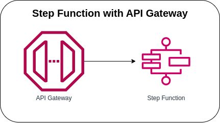

# Step Functions with API Gateway



Invoking the Step Function using the API Gateway. Configuring the API Gateway Integration settings, for **AWS Service** it must be **`Step Function`**, for **Action Type**, you must use the **`Use action name`** and enter the **`StartSyncExecution`** for **Action**.

### State Machine Definition
```json
{
  "StartAt": "Pass",
  "States": {
    "Pass": {
      "Type": "Pass",
      "End": true
    }
  }
}
```

### Sample Payload
```json
{
  "input": "{}",
  "name": "MyExecution"
}
```

### Sample API Gateway Response
```json
{
  "billingDetails": {
    "billedDurationInMilliseconds": 100,
    "billedMemoryUsedInMB": 64
  },
  "executionArn": "arn:aws:states:us-east-1:123456789101:express:sf-state-machine:1fe234a5-d61a-7891-0cdf-11121d3141b5:1efa2345-b678-9101-1ade-12f1ed314ccc",
  "input": "{\"input\":\"{}\",\"name\":\"MyExecution\"}",
  "inputDetails": {
    "__type": "com.amazonaws.swf.base.model#CloudWatchEventsExecutionDataDetails",
    "included": true
  },
  "name": "1fe234a5-d61a-7891-0cdf-11121d3141b5",
  "output": "{\"input\":\"{}\",\"name\":\"MyExecution\"}",
  "outputDetails": {
    "__type": "com.amazonaws.swf.base.model#CloudWatchEventsExecutionDataDetails",
    "included": true
  },
  "startDate": 1.683799126827E9,
  "stateMachineArn": "arn:aws:states:us-east-1:123456789101:stateMachine:sf-state-machine",
  "status": "SUCCEEDED",
  "stopDate": 1.683799126837E9,
  "traceHeader": "Root=1-234cbc56-78eecf9101bc112f131e41a5;Parent=12d345678d9d10dd;Sampled=1"
}
```

### AWS CDK API / Developer Reference
* [AWS Step Functions](https://docs.aws.amazon.com/cdk/api/v2/docs/aws-cdk-lib.aws_stepfunctions-readme.html)
* [Amazon API Gateway](https://docs.aws.amazon.com/cdk/api/v2/docs/aws-cdk-lib.aws_apigateway-readme.html)

### AWS Documentation Developer Guide
* [States](https://docs.aws.amazon.com/step-functions/latest/dg/concepts-states.html)
* [StartExecution](https://docs.aws.amazon.com/step-functions/latest/apireference/API_StartExecution.html)
* [Amazon States Language](https://states-language.net/spec.html)
* [AWS Step Function Guides](https://www.youtube.com/playlist?list=PL9nWRykSBSFgQrO66TmO1vHFP6yuPF5G-)
* [Input and Output Processing in Step Functions](https://docs.aws.amazon.com/step-functions/latest/dg/concepts-input-output-filtering.html)
* [Creating a Step Functions API Using API Gateway](https://docs.aws.amazon.com/step-functions/latest/dg/tutorial-api-gateway.html)
* [API Gateway mapping template and access logging variable reference](https://docs.aws.amazon.com/apigateway/latest/developerguide/api-gateway-mapping-template-reference.html)

### Useful commands

* `npm run build`   compile typescript to js
* `npm run watch`   watch for changes and compile
* `npm run test`    perform the jest unit tests
* `cdk deploy`      deploy this stack to your default AWS account/region
* `cdk diff`        compare deployed stack with current state
* `cdk synth`       emits the synthesized CloudFormation template

## Deploy

### Using make command
1. Install all the dependencies, bootstrap your project, and synthesized CloudFormation template.
    ```bash
    # Without passing "profile" parameter
    dev@dev:~:aws-cdk-samples/step-functions/step-functions-api-gateway$ make init

    # With "profile" parameter
    dev@dev:~:aws-cdk-samples/step-functions/step-functions-api-gateway$ make init profile=[profile_name]
    ```

2. Deploy the project.
    ```bash
    # Without passing "profile" parameter
    dev@dev:~:aws-cdk-samples/step-functions/step-functions-api-gateway$ make deploy

    # With "profile" parameter
    dev@dev:~:aws-cdk-samples/step-functions/step-functions-api-gateway$ make deploy profile=[profile_name]
    ```