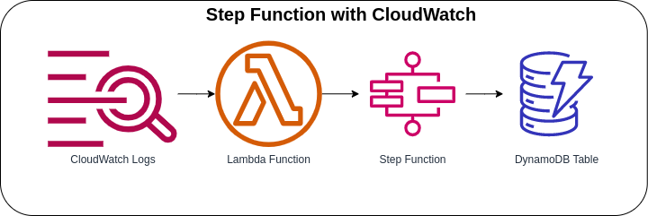

# Step Functions with CloudWatch



Invoking the Lambda Function with a CloudWatch Logs event. Every log that is created or matches the filter pattern will automatically invoke the Lambda Function and start the Step Function State Machine. The AWS Step Function State Machine will call DynamoDB API for PUT item operation to create a new item and store the CloudWatch Logs event.

### State Machine Definition
```json
{
  "StartAt": "ErrorLogPutItem",
  "States": {
    "ErrorLogPutItem": {
      "End": true,
      "Type": "Task",
      "Resource": "arn:aws:states:::dynamodb:putItem",
      "Parameters": {
        "Item": {
          "ID": {
            "S.$": "$.logEvents[0].id"
          },
          "Owner": {
            "S.$": "$.owner"
          },
          "LogGroup": {
            "S.$": "$.logGroup"
          },
          "LogStream": {
            "S.$": "$.logStream"
          },
          "Message": {
            "S.$": "$.logEvents[0].message"
          },
          "Timestamp": {
            "N.$": "States.JsonToString($.logEvents[0].timestamp)"
          }
        },
        "TableName": "error-logs"
      }
    }
  }
}
```

### AWS CDK API / Developer Reference
* [AWS Lambda](https://docs.aws.amazon.com/cdk/api/v2/docs/aws-cdk-lib.aws_lambda-readme.html)
* [AWS Step Functions](https://docs.aws.amazon.com/cdk/api/v2/docs/aws-cdk-lib.aws_stepfunctions-readme.html)
* [Amazon CloudWatch Logs](https://docs.aws.amazon.com/cdk/api/v2/docs/aws-cdk-lib.aws_logs-readme.html)
* [Tasks for Steps Functions](https://docs.aws.amazon.com/cdk/api/v2/docs/aws-cdk-lib.aws_stepfunctions_tasks-readme.html)
* [AWS CloudWatch Logs Subscription Destination](https://docs.aws.amazon.com/cdk/api/v2/docs/aws-cdk-lib.aws_logs_destinations-readme.html)

### AWS SDK v2 API / Developer Reference
* [Getting Started with the AWS SDK for Go V2](https://aws.github.io/aws-sdk-go-v2/docs/getting-started/)
* [Step Functions Documentation](https://pkg.go.dev/github.com/aws/aws-sdk-go-v2/service/sfn)

### AWS Documentation Developer Guide
* [States](https://docs.aws.amazon.com/step-functions/latest/dg/concepts-states.html)
* [Amazon States Language](https://states-language.net/spec.html)
* [AWS Step Function Guides](https://www.youtube.com/playlist?list=PL9nWRykSBSFgQrO66TmO1vHFP6yuPF5G-)
* [Using Lambda with CloudWatch Logs](https://docs.aws.amazon.com/lambda/latest/dg/services-cloudwatchlogs.html)
* [Input and Output Processing in Step Functions](https://docs.aws.amazon.com/step-functions/latest/dg/concepts-input-output-filtering.html)

### Useful commands

* `npm run build`   compile typescript to js
* `npm run watch`   watch for changes and compile
* `npm run test`    perform the jest unit tests
* `cdk deploy`      deploy this stack to your default AWS account/region
* `cdk diff`        compare deployed stack with current state
* `cdk synth`       emits the synthesized CloudFormation template

## Deploy

### Using make command
1. Install all the dependencies, bootstrap your project, and synthesized CloudFormation template.
    ```bash
    # Without passing "profile" parameter
    dev@dev:~:aws-cdk-samples/step-functions/step-functions-cloudwatch$ make init

    # With "profile" parameter
    dev@dev:~:aws-cdk-samples/step-functions/step-functions-cloudwatch$ make init profile=[profile_name]
    ```

2. Deploy the project.
    ```bash
    # Without passing "profile" parameter
    dev@dev:~:aws-cdk-samples/step-functions/step-functions-cloudwatch$ make deploy

    # With "profile" parameter
    dev@dev:~:aws-cdk-samples/step-functions/step-functions-cloudwatch$ make deploy profile=[profile_name]
    ```
