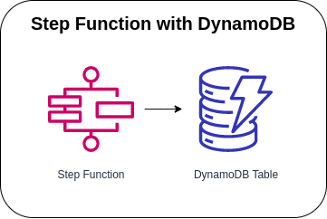

# Step Functions with CloudWatch



Starting the execution of the Step Function State Machine via AWS Console to call the DynamoDB APIs from a Task state. The State Machine accepts values in a JSON format (please see [sample payload](#sample-payload)) and will execute the specific DynamoDB API depending on the input received.

### State Machine Definition
```json
{
  "StartAt": "transaction-type",
  "States": {
    "transaction-type": {
      "Type": "Choice",
      "Choices": [
        {
          "Variable": "$.transaction_type",
          "StringEquals": "delete",
          "Next": "delete-user"
        },
        {
          "Variable": "$.transaction_type",
          "StringEquals": "insert",
          "Next": "insert-user"
        },
        {
          "Variable": "$.transaction_type",
          "StringEquals": "update:username",
          "Next": "update-username"
        },
        {
          "Variable": "$.transaction_type",
          "StringEquals": "update:password",
          "Next": "update-password"
        }
      ]
    },
    "delete-user": {
      "End": true,
      "Type": "Task",
      "ResultPath": null,
      "Resource": "arn:aws:states:::dynamodb:deleteItem",
      "Parameters": {
        "Key": {
          "ID": {
            "S.$": "$.id"
          }
        },
        "TableName": "users-table"
      }
    },
    "insert-user": {
      "End": true,
      "Type": "Task",
      "Resource": "arn:aws:states:::dynamodb:putItem",
      "Parameters": {
        "Item": {
          "ID": {
            "S.$": "$.id"
          },
          "Username": {
            "S.$": "$.username"
          },
          "Password": {
            "S.$": "$.password"
          },
          "FirstName": {
            "S.$": "$.first_name"
          },
          "LastName": {
            "S.$": "$.last_name"
          },
          "Role": {
            "S.$": "$.role"
          }
        },
        "TableName": "users-table"
      }
    },
    "update-username": {
      "End": true,
      "Type": "Task",
      "Resource": "arn:aws:states:::dynamodb:updateItem",
      "Parameters": {
        "Key": {
          "ID": {
            "S.$": "$.id"
          }
        },
        "TableName": "users-table",
        "ConditionExpression": "attribute_exists(ID)",
        "ExpressionAttributeValues": {
          ":username": {
            "S.$": "$.username"
          }
        },
        "UpdateExpression": "SET Username = :username"
      }
    },
    "update-password": {
      "End": true,
      "Type": "Task",
      "Resource": "arn:aws:states:::dynamodb:updateItem",
      "Parameters": {
        "Key": {
          "ID": {
            "S.$": "$.id"
          }
        },
        "TableName": "users-table",
        "ConditionExpression": "attribute_exists(ID)",
        "ExpressionAttributeValues": {
          ":password": {
            "S.$": "$.password"
          }
        },
        "UpdateExpression": "SET Password = :password"
      }
    }
  }
}
```

### Sample Payload

#### Insert
```json
{
  "transaction_type": "insert",
  "id": "1642023-92618",
  "username": "j.doe",
  "password": "JohnDoe12345",
  "first_name": "John",
  "last_name": "Doe",
  "role": "Admin"
}
```

#### Update Username
```json
{
  "transaction_type": "update:username",
  "id": "1642023-92618",
  "username": "j.doenut.27"
}
```

#### Update Password
```json
{
  "transaction_type": "update:password",
  "id": "1642023-92618",
  "password": "doenut.john"
}
```

#### Delete
```json
{
  "transaction_type": "delete",
  "id": "1642023-92618"
}
```

### AWS CDK API / Developer Reference
* [Amazon DynamoDB](https://docs.aws.amazon.com/cdk/api/v2/docs/aws-cdk-lib.aws_dynamodb-readme.html)
* [AWS Step Functions](https://docs.aws.amazon.com/cdk/api/v2/docs/aws-cdk-lib.aws_stepfunctions-readme.html)
* [Amazon CloudWatch Logs](https://docs.aws.amazon.com/cdk/api/v2/docs/aws-cdk-lib.aws_logs-readme.html)
* [Tasks for Steps Functions](https://docs.aws.amazon.com/cdk/api/v2/docs/aws-cdk-lib.aws_stepfunctions_tasks-readme.html)

### AWS Documentation Developer Guide
* [States](https://docs.aws.amazon.com/step-functions/latest/dg/concepts-states.html)
* [Amazon States Language](https://states-language.net/spec.html)
* [AWS Step Function Guides](https://www.youtube.com/playlist?list=PL9nWRykSBSFgQrO66TmO1vHFP6yuPF5G-)
* [Input and Output Processing in Step Functions](https://docs.aws.amazon.com/step-functions/latest/dg/concepts-input-output-filtering.html)

### Useful commands

* `npm run build`   compile typescript to js
* `npm run watch`   watch for changes and compile
* `npm run test`    perform the jest unit tests
* `cdk deploy`      deploy this stack to your default AWS account/region
* `cdk diff`        compare deployed stack with current state
* `cdk synth`       emits the synthesized CloudFormation template

## Deploy

### Using make command
1. Install all the dependencies, bootstrap your project, and synthesized CloudFormation template.
    ```bash
    # Without passing "profile" parameter
    dev@dev:~:aws-cdk-samples/step-functions/step-functions-dynamodb$ make init

    # With "profile" parameter
    dev@dev:~:aws-cdk-samples/step-functions/step-functions-dynamodb$ make init profile=[profile_name]
    ```

2. Deploy the project.
    ```bash
    # Without passing "profile" parameter
    dev@dev:~:aws-cdk-samples/step-functions/step-functions-dynamodb$ make deploy

    # With "profile" parameter
    dev@dev:~:aws-cdk-samples/step-functions/step-functions-dynamodb$ make deploy profile=[profile_name]
    ```