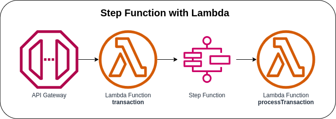

# Step Function with Lambda



Invoking the first Lambda function with an AWS API Gateway. Once the first Lambda function receives the incoming request from the API Gateway, it will validate the request and start the Step Function State Machine. The AWS Step Function State Machine will trigger the second Lambda Function if the `transaction_type` is either `PURCHASE` or `REJECTED`.

The second Lambda Function will receive the event as JSON text as the input and will process the received event (`json.RawMessage`). It is because the individual states receive JSON as input and usually pass JSON as output to the next state.

### State Machine Definition
```json
{
  "StartAt": "processTransactionTask",
  "States": {
    "processTransactionTask": {
      "End": true,
      "Type": "Task",
      "InputPath": "$",
      "Resource": "arn:aws:states:::lambda:invoke",
      "Parameters": {
        "FunctionName": "arn:aws:lambda:region:account_id:function:processTransaction",
        "Payload.$": "$"
      }
    }
  }
}
```

## API Specification
When the API received an incoming request, it will validate if the required fields are present, start the Step Function State Machine, and will return an HTTP Status OK.

**Method**: POST

**Endpoint**: `https://{api-id}.execute.api.{region}.amazonaws.com/prod/`

**Request Body**
```json
{
  "customerId": "84378220428",
  "card_number": "4444 4444 8888 8888",
  "transaction_type": "PURCHASE"
}
```

### AWS CDK API / Developer Reference
* [AWS Lambda](https://docs.aws.amazon.com/cdk/api/v2/docs/aws-cdk-lib.aws_lambda-readme.html)
* [AWS Step Functions](https://docs.aws.amazon.com/cdk/api/v2/docs/aws-cdk-lib.aws_stepfunctions-readme.html)
* [Tasks for Steps Functions](https://docs.aws.amazon.com/cdk/api/v2/docs/aws-cdk-lib.aws_stepfunctions_tasks-readme.html)

### AWS SDK v2 API / Developer Reference
* [Getting Started with the AWS SDK for Go V2](https://aws.github.io/aws-sdk-go-v2/docs/getting-started/)
* [Step Functions Documentation](https://pkg.go.dev/github.com/aws/aws-sdk-go-v2/service/sfn)

### AWS Documentation Developer Guide
* [States](https://docs.aws.amazon.com/step-functions/latest/dg/concepts-states.html)
* [Amazon States Language](https://states-language.net/spec.html)
* [AWS Step Function Guides](https://www.youtube.com/playlist?list=PL9nWRykSBSFgQrO66TmO1vHFP6yuPF5G-)
* [Input and Output Processing in Step Functions](https://docs.aws.amazon.com/step-functions/latest/dg/concepts-input-output-filtering.html)

### Useful commands

* `npm run build`   compile typescript to js
* `npm run watch`   watch for changes and compile
* `npm run test`    perform the jest unit tests
* `cdk deploy`      deploy this stack to your default AWS account/region
* `cdk diff`        compare deployed stack with current state
* `cdk synth`       emits the synthesized CloudFormation template

## Deploy

### Using make command
1. Install all the dependencies, bootstrap your project, and synthesized CloudFormation template.
    ```bash
    # Without passing "profile" parameter
    dev@dev:~:aws-cdk-samples/step-functions/step-functions-lambda$ make init

    # With "profile" parameter
    dev@dev:~:aws-cdk-samples/step-functions/step-functions-lambda$ make init profile=[profile_name]
    ```

2. Deploy the project.
    ```bash
    # Without passing "profile" parameter
    dev@dev:~:aws-cdk-samples/step-functions/step-functions-lambda$ make deploy

    # With "profile" parameter
    dev@dev:~:aws-cdk-samples/step-functions/step-functions-lambda$ make deploy profile=[profile_name]
    ```