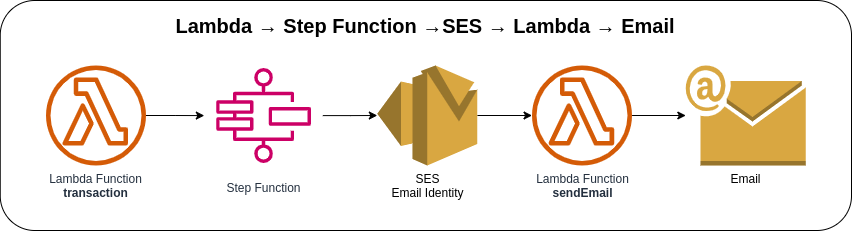
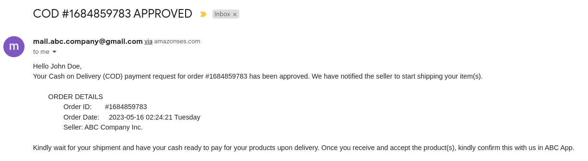
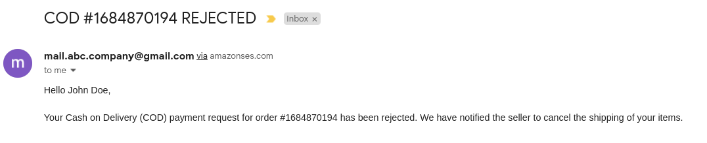

# Step Function with SES



Invoking the first Lambda Function via AWS Console or AWS CLI to create a transaction. Once the first Lambda function receives the incoming request, it will validate the request and start the Step Function State Machine. The AWS Step Function State Machine will trigger the second Lambda Function that will send an e-mail using the configured e-mail identity on AWS SES. The e-mail identity must be verified beforehand, and remember that the e-mail address is case-sensitive. The Lambda Function must have permission or is authorized to perform **`ses:SendEmail`** on the SES resource identity.

### Invoking Lambda function via AWS Console
1. Go to Lambda → Lambda Function → ***Test*** tab
2. Update the Event JSON textarea field (see [sample payload](#sample-payload))
3. Click on the **Test** button in the upper right corner

### Invoking Lambda function via AWS CLI
1. Use the following command and replace the placeholder `lambda_function_name` with the actual Lambda function name
    ```bash
    aws lambda invoke \
    --function-name lambda_function_name \
    --payload '{"transaction_type": "PURCHASE", "customer": {"first_name": "John", "last_name": "Doe", "email": "j.doe@email.com"}}' \
    --cli-binary-format raw-in-base64-out \
    response.json
    ```

### Sample Payload
```json
{
  "transaction_type": "PURCHASE",
  "customer": {
    "first_name": "John",
    "last_name": "Doe",
    "email": "j.doe@email.com"
  }
}
```

### Sample E-mail via Amazon SES
#### Purchase


#### Rejected


### State Machine Definition
```json
{
  "StartAt": "step-function-task",
  "States": {
    "step-function-task": {
      "End": true,
      "Type": "Task",
      "InputPath": "$",
      "Resource": "arn:aws:states:::lambda:invoke",
      "Parameters": {
        "FunctionName": "arn:aws:lambda:us-east-1:123456789101:function:sendEmail",
        "Payload.$": "$"
      }
    }
  }
}
```

### AWS CDK API / Developer Reference
* [AWS Lambda](https://docs.aws.amazon.com/cdk/api/v2/docs/aws-cdk-lib.aws_lambda-readme.html)
* [AWS Step Functions](https://docs.aws.amazon.com/cdk/api/v2/docs/aws-cdk-lib.aws_stepfunctions-readme.html)
* [Tasks for Steps Functions](https://docs.aws.amazon.com/cdk/api/v2/docs/aws-cdk-lib.aws_stepfunctions_tasks-readme.html)
* [Amazon Simple Email Service](https://docs.aws.amazon.com/cdk/api/v2/docs/aws-cdk-lib.aws_ses-readme.html)

### AWS SDK v2 API / Developer Reference
* [Getting Started with the AWS SDK for Go V2](https://aws.github.io/aws-sdk-go-v2/docs/getting-started/)
* [SES v2 Documentation](https://pkg.go.dev/github.com/aws/aws-sdk-go-v2/service/sesv2)
* [Step Functions Documentation](https://pkg.go.dev/github.com/aws/aws-sdk-go-v2/service/sfn)

### AWS Documentation Developer Guide
* [States](https://docs.aws.amazon.com/step-functions/latest/dg/concepts-states.html)
* [Amazon States Language](https://states-language.net/spec.html)
* [AWS Step Function Guides](https://www.youtube.com/playlist?list=PL9nWRykSBSFgQrO66TmO1vHFP6yuPF5G-)
* [Send an Email with Amazon SES](https://aws.amazon.com/getting-started/hands-on/send-an-email/)
* [Verified identities in Amazon SES](https://docs.aws.amazon.com/ses/latest/dg/verify-addresses-and-domains.html)
* [Moving out of the Amazon SES sandbox](https://docs.aws.amazon.com/ses/latest/dg/request-production-access.html)
* [Input and Output Processing in Step Functions](https://docs.aws.amazon.com/step-functions/latest/dg/concepts-input-output-filtering.html)

### Useful commands

* `npm run build`   compile typescript to js
* `npm run watch`   watch for changes and compile
* `npm run test`    perform the jest unit tests
* `cdk deploy`      deploy this stack to your default AWS account/region
* `cdk diff`        compare deployed stack with current state
* `cdk synth`       emits the synthesized CloudFormation template

## Deploy

### Using make command
1. Install all the dependencies, bootstrap your project, and synthesized CloudFormation template.
  ```bash
  # Without passing "profile" parameter
  dev@dev:~:aws-cdk-samples/step-functions/step-functions-ses$ make init

  # With "profile" parameter
  dev@dev:~:aws-cdk-samples/step-functions/step-functions-ses$ make init profile=[profile_name]
  ```

2. Deploy the project.
  ```bash
  # Without passing "profile" parameter
  dev@dev:~:aws-cdk-samples/step-functions/step-functions-ses$ make deploy

  # With "profile" parameter
  dev@dev:~:aws-cdk-samples/step-functions/step-functions-ses$ make deploy profile=[profile_name]
  ```