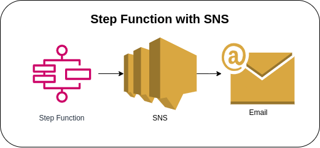
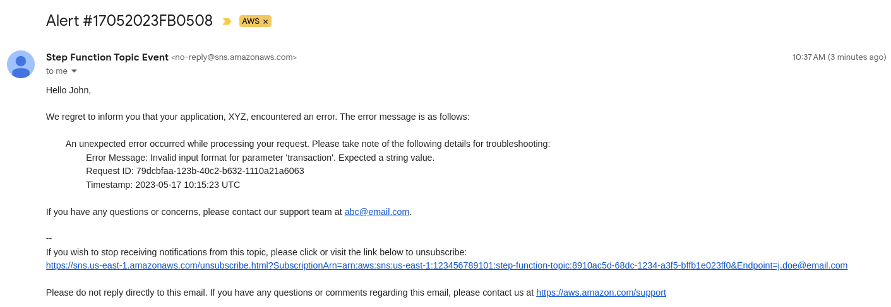

# Step Functions with SNS



Starting the execution of the Step Function State Machine via AWS Console to call the SNS Publish API from a Task state. The State Machine accepts values in a JSON format (please see [sample payload](#sample-payload)) and will execute the SNS Publish API to send a message to the configured SNS Topic.

### State Machine Definition
```json
{
  "StartAt": "step-function-definition",
  "States": {
    "step-function-definition": {
      "End": true,
      "Type": "Task",
      "ResultPath": null,
      "Resource": "arn:aws:states:::sns:publish",
      "Parameters": {
        "TopicArn": "arn:aws:sns:us-east-1:123456789101:step-function-topic",
        "Message.$": "$.content",
        "Subject.$": "$.subject"
      }
    }
  }
}
```

### Sample Payload
```json
{
  "subject": "Alert #17052023FB0508",
  "content": "Hello John,\n\nWe regret to inform you that your application, XYZ, encountered an error. The error message is as follows:\n\n\tAn unexpected error occurred while processing your request. Please take note of the following details for troubleshooting:\n\t\tError Message: Invalid input format for parameter 'transaction'. Expected a string value.\n\t\tRequest ID: 79dcbfaa-123b-40c2-b632-1110a21a6063\n\t\tTimestamp: 2023-05-17 10:15:23 UTC\n\nIf you have any questions or concerns, please contact our support team at abc@email.com."
}
```

### Sample SNS Email


### AWS CDK API / Developer Reference
* [AWS Step Functions](https://docs.aws.amazon.com/cdk/api/v2/docs/aws-cdk-lib.aws_stepfunctions-readme.html)
* [Amazon CloudWatch Logs](https://docs.aws.amazon.com/cdk/api/v2/docs/aws-cdk-lib.aws_logs-readme.html)
* [Tasks for Steps Functions](https://docs.aws.amazon.com/cdk/api/v2/docs/aws-cdk-lib.aws_stepfunctions_tasks-readme.html)
* [Amazon Simple Notification Service](https://docs.aws.amazon.com/cdk/api/v2/docs/aws-cdk-lib.aws_sns-readme.html)

### AWS Documentation Developer Guide
* [States](https://docs.aws.amazon.com/step-functions/latest/dg/concepts-states.html)
* [Amazon States Language](https://states-language.net/spec.html)
* [AWS Step Function Guides](https://www.youtube.com/playlist?list=PL9nWRykSBSFgQrO66TmO1vHFP6yuPF5G-)
* [Service Integration Patterns](https://docs.aws.amazon.com/step-functions/latest/dg/connect-to-resource.html)
* [Call Amazon SNS with Step Functions](https://docs.aws.amazon.com/step-functions/latest/dg/connect-sns.html)
* [Input and Output Processing in Step Functions](https://docs.aws.amazon.com/step-functions/latest/dg/concepts-input-output-filtering.html)

### Useful commands

* `npm run build`   compile typescript to js
* `npm run watch`   watch for changes and compile
* `npm run test`    perform the jest unit tests
* `cdk deploy`      deploy this stack to your default AWS account/region
* `cdk diff`        compare deployed stack with current state
* `cdk synth`       emits the synthesized CloudFormation template

## Deploy

### Using make command
1. Install all the dependencies, bootstrap your project, and synthesized CloudFormation template.
    ```bash
    # Without passing "profile" parameter
    dev@dev:~:aws-cdk-samples/step-functions/step-functions-sns$ make init

    # With "profile" parameter
    dev@dev:~:aws-cdk-samples/step-functions/step-functions-sns$ make init profile=[profile_name]
    ```

2. Deploy the project.
    ```bash
    # Without passing "profile" parameter
    dev@dev:~:aws-cdk-samples/step-functions/step-functions-sns$ make deploy

    # With "profile" parameter
    dev@dev:~:aws-cdk-samples/step-functions/step-functions-sns$ make deploy profile=[profile_name]
    ```