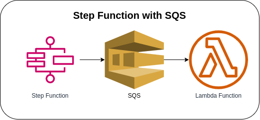

# Step Functions with SQS



Starting the execution of the Step Function State Machine via AWS Console to call the SQS `SendMessage` API from a Task state. The State Machine accepts values in a JSON format (please see [sample payload](#sample-payload)) and will execute the SQS `SendMessage` API to send a message to the configured SQS Queue, and the Lambda Function will process the received event from the Amazon SQS event message.

### State Machine Definition
```json
{
  "StartAt": "transaction-definition",
  "States": {
    "transaction-definition": {
      "End": true,
      "Type": "Task",
      "Resource": "arn:aws:states:::sqs:sendMessage",
      "Parameters": {
        "QueueUrl": "https://sqs.us-east-1.amazonaws.com/123456789101/transaction-queue.fifo",
        "MessageBody": {
          "id.$": "$.id",
          "order_line_id.$": "$.line_id",
          "total.$": "$.total",
          "change.$": "$.change",
          "customer.$": "$.customer"
        },
        "MessageGroupId": "process.transaction"
      }
    }
  }
}
```

### Sample Payload
```json
{
	"id": "transaction-12345",
	"line_id": "line-12345",
	"total": 250.50,
	"change": 249.50,
	"customer": {
		"id": "customer-12345",
		"name": "John Doe"
	}
}
```

### Sample CloudWatch Log
```json
{
  "log_code": "SQSMessage",
  "log_msg": "recieved event from Amazon SQS",
  "log_level": "INFO",
  "log_keys": {
    "transaction": {
      "id": "transaction-12345",
      "order_line_id": "line-12345",
      "customer": {
        "id": "customer-12345",
        "name": "John Doe"
      },
      "total": 250.5,
      "change": 249.5
    }
  },
  "log_timestamp": "2023-05-17 05:51:23"
}
```

### AWS CDK API / Developer Reference
* [AWS Lambda](https://docs.aws.amazon.com/cdk/api/v2/docs/aws-cdk-lib.aws_lambda-readme.html)
* [AWS Step Functions](https://docs.aws.amazon.com/cdk/api/v2/docs/aws-cdk-lib.aws_stepfunctions-readme.html)
* [Tasks for Steps Functions](https://docs.aws.amazon.com/cdk/api/v2/docs/aws-cdk-lib.aws_stepfunctions_tasks-readme.html)
* [Amazon CloudWatch Logs](https://docs.aws.amazon.com/cdk/api/v2/docs/aws-cdk-lib.aws_logs-readme.html)
* [AWS Lambda Event Sources](https://docs.aws.amazon.com/cdk/api/v2/docs/aws-cdk-lib.aws_lambda_event_sources-readme.html)
* [Amazon Simple Queue Service](https://docs.aws.amazon.com/cdk/api/v2/docs/aws-cdk-lib.aws_sqs-readme.html)

### AWS SDK v2 API / Developer Reference
* [AWS Lambda Events](https://github.com/aws/aws-lambda-go/blob/main/events/README.md)
* [Getting Started with the AWS SDK for Go V2](https://aws.github.io/aws-sdk-go-v2/docs/getting-started/)

### AWS Documentation Developer Guide
* [States](https://docs.aws.amazon.com/step-functions/latest/dg/concepts-states.html)
* [Amazon States Language](https://states-language.net/spec.html)
* [AWS Step Function Guides](https://www.youtube.com/playlist?list=PL9nWRykSBSFgQrO66TmO1vHFP6yuPF5G-)
* [Amazon SQS dead-letter queues](https://docs.aws.amazon.com/AWSSimpleQueueService/latest/SQSDeveloperGuide/sqs-dead-letter-queues.html)
* [Amazon SQS visibility timeout](https://docs.aws.amazon.com/AWSSimpleQueueService/latest/SQSDeveloperGuide/sqs-visibility-timeout.html)
* [Call Amazon SQS with Step Functions](https://docs.aws.amazon.com/step-functions/latest/dg/connect-sqs.html)
* [Amazon SQS FIFO (First-In-First-Out) queues](https://docs.aws.amazon.com/AWSSimpleQueueService/latest/SQSDeveloperGuide/FIFO-queues.html)
* [Input and Output Processing in Step Functions](https://docs.aws.amazon.com/step-functions/latest/dg/concepts-input-output-filtering.html)

### Useful commands
* `npm run build`   compile typescript to js
* `npm run watch`   watch for changes and compile
* `npm run test`    perform the jest unit tests
* `cdk deploy`      deploy this stack to your default AWS account/region
* `cdk diff`        compare deployed stack with current state
* `cdk synth`       emits the synthesized CloudFormation template

## Deploy
### Using make command
1. Install all the dependencies, bootstrap your project, and synthesized CloudFormation template.
    ```bash
    # Without passing "profile" parameter
    dev@dev:~:aws-cdk-samples/step-functions/step-functions-sqs$ make init

    # With "profile" parameter
    dev@dev:~:aws-cdk-samples/step-functions/step-functions-sqs$ make init profile=[profile_name]
    ```

2. Deploy the project.
    ```bash
    # Without passing "profile" parameter
    dev@dev:~:aws-cdk-samples/step-functions/step-functions-sqs$ make deploy

    # With "profile" parameter
    dev@dev:~:aws-cdk-samples/step-functions/step-functions-sqs$ make deploy profile=[profile_name]
    ```